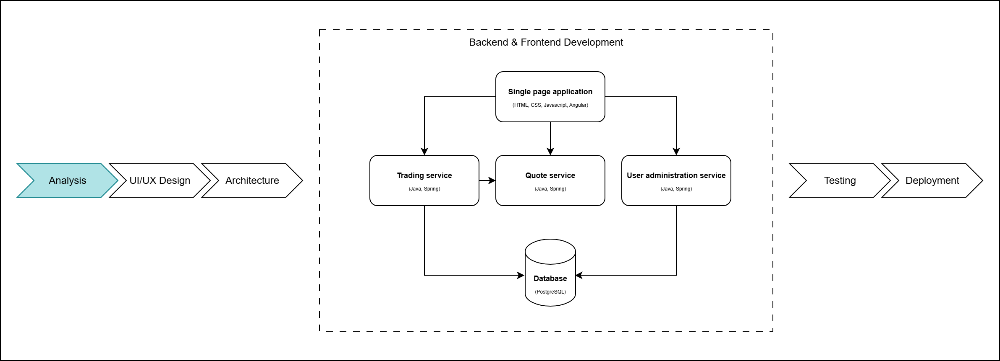
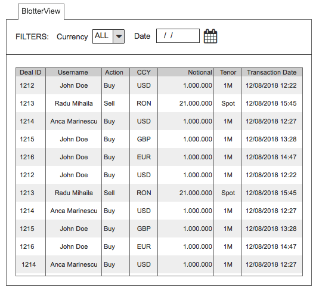
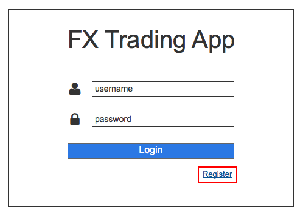
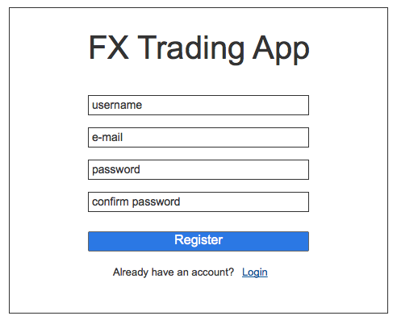
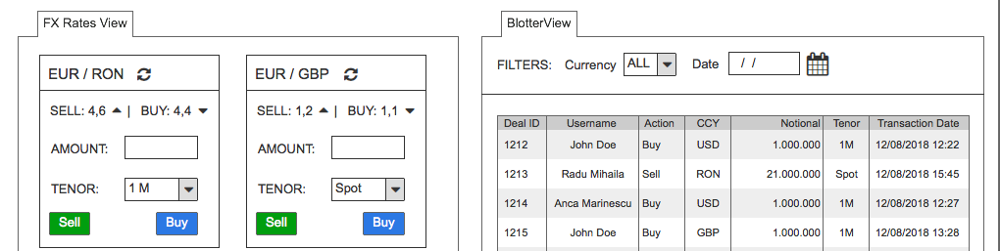
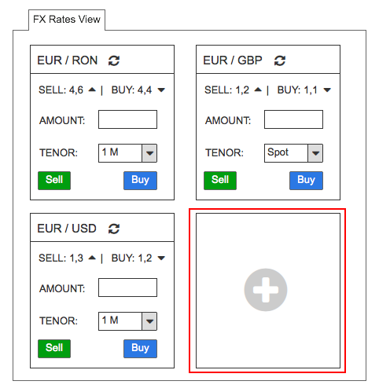
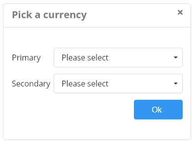
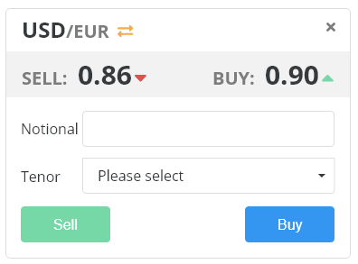

# Business Analysis

## Table of contents

- [Requirements](#requirements)
- [Exercise](#exercise)
- [Solution - User Stories](#Solution---User-Stories)
  - [USER STORY #1 – Transactions View](#user-story-#1-–-transactions-view)
  - [USER STORY #2 – Transactions Ccy Pair Filter](#user-story-#2-–-transactions-ccy-pair-filter)
  - [USER STORY #3 – Transactions Date Filter](#user-story-#3-–-transactions-date-filter)
  - [USER STORY #4 – New User Register](#user-story-#4-–-new-user-register)
  - [USER STORY #5 – Error Messages for Register Form](#user-story-#5-–-error-messages-for-register-form)
  - [USER STORY #6 – Fx Rates View](#user-story-#6-–-fx-rates-view)
  - [USER STORY #7 – Currency selection widget](#user-story-#7-–-currency-selection-widget)
  - [User Role Matrix](#user-role-matrix)

## Requirements

FX Trading application pages:

### Register page

A page that allows the creation of a new account.

The page contains the following elements:

- “username” field
- “email” field
- “password” field
- “password confirmation” field
- “register” button
- “Already have an account?” text that redirects the user to the login page

### Login page

A page that allows an user to login, giving them access to the FX Trading Dashboard.

The page contains the following elements:

- username field
- password field
- login button
- “Don’t have an account” link that redirects the user to the Register page
- “Forgot my password” link

### FX Trading Dashboard

This page will give the users the option to sell and buy currency (called FX Rate View) and also view a history of the trades (called blotter view). The user is going to be part of a team and is able to see other team members’ activity.

### FX Rate View

FX rate gives user the option to trade several currencies (USD, EUR, GBP, RON and CHF).
Users must use one currency to buy one of the other currencies.
Users should be able to customize some aspects of the User Interface.

Elements needed:

- currency I want to buy (eg. EUR)
- currency I want to sell (eg. RON)
- currency exchange rates for sell/buy actions (eg. EUR/RON - buy: 4,6100 / sell: 4,7350)
- notional - amount I want to buy/sell (eg. 1.000.000)
- tenor - When the trade will take place (eg. Now / 1 Month / 3 Months)
- buy Button
- sell Button

The user must be able to add more currency combinations to the dashboard (EUR/RON, EUR/USD, CHF/USD, etc.)

### Blotter View

The blotter view displays a transaction history for the user and other users in their team.

Fields needed:

- transaction id
- username
- currency pair (USD/EUR)
- currency exchange rate
- action (sell/buy)
- notional
- tenor
- transaction date/time

The user should be able to apply 2 filters to the dataset described above (currency pair, transaction date)

## Exercise

Analyse the user requirements and based on them try to create user stories for the three main pages. Get feedback from the user and improve stories until you reach the optimal solution for their needs.

## Solution - User Stories

### USER STORY #1 – Transactions View

**As a** Trader (authenticated user in FX Trading application)

**I want to** see all the past transactions of all authenticated Traders

**So that** I can conclude on the pattern of trades and make my transactions on the basis of this analysis.

_Please check the [mock-up](../../Week_03/Exercise/README.md) for guidelines on how it could look. This does not have to be the actual implementation, as the design might be different, but the same kind of information must be present in the actual implementation._

**Acceptance Criteria:**

#### AC#1 – Past Transactions View

**Given that** I am a Trader

**When** I authenticate in the FX Trading application

**Then** I am able to see the past transactions of all registered Traders, with the following information for each of them:

| Column Name          | Description                                                                                                                                                                   |
|----------------------|-------------------------------------------------------------------------------------------------------------------------------------------------------------------------------|
| ID                   | Shows the Transaction ID, as an integer.   It is generated by the system for each new Trade.                                                                                   |
| Username             | Shows the username of the Trader doing the transaction                                                                                                                        |
| Ccy Pair             | Provides the currencies being traded.   Each currency is shown as a three-digit value.   The separator is “/”.                                                                  |
| Rate                 | Shows the rate between currencies used for the respective transactions.                                                                                                       |
| Action               | Shows the action type, which can be “BUY” or “SELL”                                                                                                                           |
| Notional             | Shows the amount being traded                                                                                                                                                 |
| Tenor                | Provides the length of time before the trade expires.   It can be one month (“1M”), three months (“3M”) or Spot – the date when the trader exchanged the currencies (“SP”).     |
| Transaction Date     | It is the date when the transaction was executed, in format “dd/mm/yyyy hh:mm”                                                                                                |

#### AC#2 – Transactions Default Ordering

**Given that:**

* I am a Trader
* AC#1 is in place

**When** I authenticate in the FX Trading application & I check the Transaction View

**Then** by default the Transactions are ordered based on the Transaction Date, ascending (oldest Transaction Date on top)

### USER STORY #2 – Transactions Ccy Pair Filter

**As a** Trader (authenticated user in FX Trading application)

**I want to** be able to filter the past transactions based on the Currency Pair

**So that** I can easily retrieve the information I need for my trading activity.

**Acceptance Criteria:**

#### AC#1

**Given that:**

* I am a Trader
* USER STORY#1 is in place

**When** I authenticate in the FX Trading application & I check the Transaction View

**Then** I can filter the Transaction based on the Currency Pair.

The filter must be named “Ccy Pair”. By default, no “Ccy Pair” filtering will be applied.

It allows the user to select from a list of values with all defined Currency Pairs the one they want to use for filtering the transactions.

#### AC#2 – negative scenario

**Given that:**

* I am a Trader
* AC#1 is in place

**When** I try to filter based on multiple Currency Pairs at a time

**Then** the system will not allow this action – once a new Ccy Pair value is selected, the previously selected one will get un-selected.

### USER STORY #3 – Transactions Date Filter

**As a** Trader (authenticated user in FX Trading application)

**I want to** be able to filter the past transactions based on the date they were performed

**So that** I can easily retrieve the information I need for my trading activity.

**Acceptance Criteria:**

#### AC#1 – Transactions Date Filter

**Given that:**

* I am a Trader
* USER STORY #1 is in place

**When** I authenticate in the FX Trading application & I check the Transaction View

**Then** I can filter the Transaction based on the Transaction Date.

Based on this input, the Transactions will be filtered and only those traded on the specific date provided by the user will be displayed. By default, no Transaction Date filtering will be applied.

The Transaction Date filter allows the user to select a date from a calendar picker or to manually input it in format dd/mm/yyyy.

#### AC#2 – negative scenario (wrong date format)

**Given that:**

* I am a Trader
* AC#1 is in place

**When** I provide an incorrect Transaction Date, different than dd/mm/yyyy

**Then** the system will display a message “Invalid Format”.

It will still allow the user to select or manually input another Transaction Date.

#### AC#3 – negative scenario (wrong date format)

**Given that:**

* I am a Trader
* AC#1 is in place

**When** I provide a future date for Transaction Date filter

**Then** the system will display a message “No future dates allowed”.

It will still allow the user to select or manually input another Transaction Date.

#### Transaction View Mock-up

### USER STORY #4 – New User Register

**As an** unregistered user

**I want to** be able to register in the FX Trading application

**So that** I can perform my trading activity.

**Acceptance Criteria:**

#### AC#1 – Link to Register

**Given** I am an unregistered user

**When** I go to the Login page

**Then** I should see a hyperlink to Register, which should be positioned as in the mockup below:

#### AC#2 – Register Form

**Given**

* I am an unregistered user
* AC#1 is in place

**When** I follow the hyperlink to Register

**Then** I should see a form called **Register a new account**, having the following fields:

| Field Name           | Field Type                                                                                                             | Mandatory/Optional Field     | Position of the Field                               | Default Value     |
|----------------------|------------------------------------------------------------------------------------------------------------------------|------------------------------|-----------------------------------------------------|-------------------|
| Username             | Free text    Min 6 characters    Max 256 characters                                                                      | Mandatory                    | Below Register a new account – see mockup below     | username          |
| Email                | Free text    Max 256 characters   Email format                                                                          | Mandatory                    | Below Username – see mockup below                   | email address     |
| Password             | Free text    Min 6 characters    Max 256 characters, key sensitive                                                       | Mandatory                    | Below Email – see mockup below                      | password          |
| Confirm Password     | Free text   Max 256 characters   **Validation on the value:**   It should be same value as the one in “Password” field     | Mandatory                    | Below Password– see mockup below                    | password          |

**Register Form mockup:**

#### AC#3 – New Account Creation

**Given** I am an unregistered user

**When** fill out all the Register form fields by complying with the validations and I click on **Register** button

**Then**

* **“Registration Successful”** Message will be displayed
* A new account will be created
* I will be automatically redirected to the Login page (see mockup in AC#1).

#### AC#4 – New User Login**

**Given**

* AC#3 in place
* I am redirected to the Login page

**When** fill out all the Login form fields by complying with the validations and I click on **Login** button

**Then** I will be automatically logged in and redirected to Dashboard page**.**

### USER STORY #5 – Error Messages for Register Form

**As an** unregistered user

**I want to** receive the proper error messages when invalid data is input in the Register form

**So that** I succeed in creating and activating my account in the FX Trading application

**Acceptance Criteria:**

#### AC#1 – Error Message for missing Username

**Given** I am an unregistered user

**When**

* I am in the Register form
* Do not fill in any username
* Click on Register button

**Then** the following message should be displayed, in bold red: ‘Username is required!’

#### AC#2 – Error Message for invalid Username

**Given** I am an unregistered user

**When**

* I am in the Register form
* I fill in an username which doesn’t meet the validation criteria mentioned in User Story#4, AC#2
* Click on Register button

**Then** the following message should be displayed, in bold red: ‘Username should contain letters, special characters (-, _, .) and must have at least 6 characters!’

#### AC#3– Error Message for missing Email address

**Given** I am an unregistered user

**When**

* I am in the Register form
* Do not fill in any email address
* Click on Register button

**Then** the following message should be displayed, in bold red: ‘Email is required!’

#### AC#4 – Error Message for invalid Email address

**Given** I am an unregistered user

**When**

* I am in the Register form
* I fill in an email address which doesn’t meet the validation criteria mentioned in User Story#4, AC#2
* Click on Register button

**Then** the following message should be displayed, in bold red: ‘Email address must have the format firstname.lastname@email.com!”

#### AC#5 – Error Message for missing Password

**Given** I am an unregistered user

**When**

* I am in the Register form
* Do not fill in any password
* Click on Register button

**Then** the following message should be displayed, in bold red: ‘Password is required!’

#### AC#6 – Error Message for invalid Password

**Given** I am an unregistered user

**When**

* I am in the Register form
* I fill in a password which doesn’t meet the validation criteria mentioned in User Story#4, AC#2
* Click on Register button

**Then** the following message should be displayed, in bold red: ‘Password must have at least 6 characters!’

#### AC#7 – Error Message for missing Password confirmation

**Given** I am an unregistered user

**When**

* I am in the Register form
* Do not confirm the password
* Click on Register button

**Then** the following message should be displayed, in bold red: ‘Password confirmation is required!’

#### AC#8 – Error Message for invalid Password confirmation

**Given** I am an unregistered user

**When**

* I am in the Register form, Password Confirmation field,
* I fill in a password which doesn’t meet the validation criteria mentioned in User Story#4, AC#2
* Click on Register button

**Then** the following message should be displayed, in bold red: ‘Passwords do not match! Please fill in the correct password!’

### USER STORY #6 – Fx Rates View

**As a** Trader (authenticated user in FX Trading application)

**I want to** be able to see one or more Fx Rates Views

**So that** I can decide on the transactions to be made.

**Acceptance Criteria:**

#### AC#1 – Fx Rates View Display

**Given that** I am a Trader

**When** I authenticate in the FX Trading application

**Then** I want to see a separate section called Fx Rates View as shown in the screenshot below:

#### AC#2 – Fx Rates View creation

**Given that** I am a Trader

**When** I authenticate in the FX Trading application

**Then** I want to create one or more Fx Rates widgets by clicking on the button “+”as shown in the screenshot below:

#### AC#3 – Maximum number of Fx Rates widgets

**Given that** I am a Trader, authenticated in the FX Trading application

**When** I am adding Fx Rates widgets

**Then** I want to be allowed to add a maximum of 10 widgets.

>**Note:** _When the maximum of views has been reached, then the “+” button should not be shown anymore._

### USER STORY #7 – Currency selection widget

**As a** Trader (authenticated user in FX Trading application)

**I want to** be able to see the exchange rates in real time for more currencies

**So that** I can decide on the transactions to be made.

**Acceptance Criteria:**

#### AC#1 – Currency selection screen

**Given that** I am a Trader, authenticated in the FX Trading application

**When** I click on the “+” button

**Then** I want a new widget called “Pick a Currency” to be shown having the following fields:

| Field Name     | Field Type                                                              | Mandatory/Optional Field     | Position of the Field                        | Default Value     |
|----------------|-------------------------------------------------------------------------|------------------------------|----------------------------------------------|-------------------|
| Primary        | Dropdown with the following reference data:   EUR   USD   GBP   RON     | Mandatory                    | Below Pick a Currency – see mockup below     | Please select     |
| Secondary      | Dropdown with the following reference data:   EUR   USD   GBP   RON     | Mandatory                    | Below Primary – see mockup below             | Please select     |
| OK             | Button                                                                  | Mandatory                    | Below Secondary – see mockup below           |                   |

#### AC#2 – Saving data for Currency selection screen**

**Given that** I am a Trader, authenticated in the FX Trading application

**When** I fill in all mandatory data in Currency selection widget and click the  **“OK”** button

**Then** I want my data to be saved and displayed in the widget, as per the screenshot below:

### User Role Matrix

| Action                     | Administrator | Trader |
|----------------------------|---------------|--------|
| Login                      | x             | x      |
| Logout                     | x             | x      |
| Change password            | x             | x      |
| Update profile information | x             | x      |
| Assign roles               | x             |        |
| Ban users                  | x             |        |
| Add widgets                | x             |        |
| Trade                      |               | x      |
| View Past Transactions     | x             | x      |
| Filter Past Transactions   | x             | x      |
