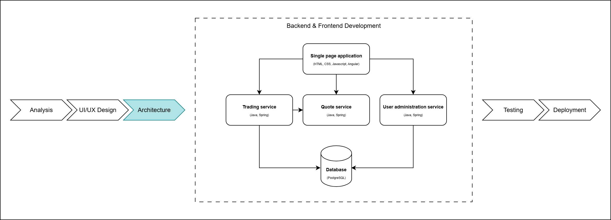
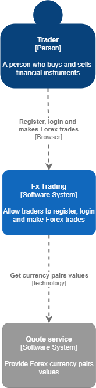

# Architecture and technology stack

## Table of contents

- [Requirements](#requirements)
  - [Exercise 1 - Architecture pattern](#exercise-1---architecture-pattern)
  - [Exercise 2 - Frontend technology stack](#exercise-2---frontend-technology-stack)
  - [Exercise 3 - Backend technology stack](#exercise-3---backend-technology-stack)
  - [Exercise 4 - Communication protocol](#exercise-4---communication-protocol)
  - [Exercise 5 - Database](#exercise-5---database)
- [Solution - Decisions to be implemented in following labs](#solution---decisions-to-be-implemented-in-following-labs)
  - [Project architecture](#project-architecture)
  - [Technology stack](#technology-stack)

## Requirements

Analyze the [user requirements and stories](../../01_Business_Analysis/Exercise/README.md) and based on them try to make architectural decisions for the trading application.

### Exercise 1 - Architecture pattern

Establish architectural pattern you would implement based on decision tree.

### Exercise 2 - Frontend technology stack

Choose frontend technologies you would choose and explain your choice.

### Exercise 3 - Backend technology stack

Choose backend technologies you would choose and explain your choice.

### Exercise 4 - Communication protocol

Choose communication protocol that best fits the application requirements and explain your choice.

### Exercise 5 - Database

Choose database type that best fits the application requirements and explain your choice.

## Solution - Decisions to be implemented in following labs

### Project architecture

[Download draw.io diagram](https://drive.google.com/file/d/1gqwqInmvqGzmxTmXexQ1iFbuM0e-E9qk/view?usp=sharing).

### Technology stack

Frontend: Angular, HTML, CSS.

Backend: Java, Spring, Spring Boot.

Protocol: HTTP, TCP.

Database: PostgreSQL.
