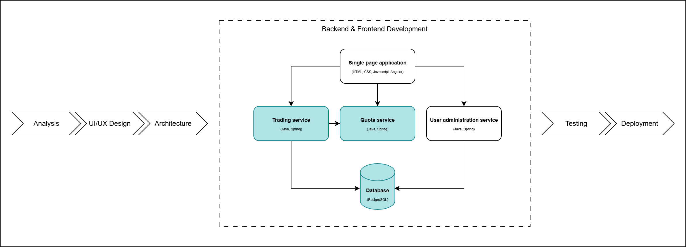
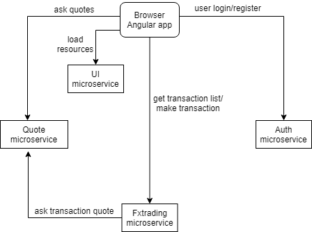
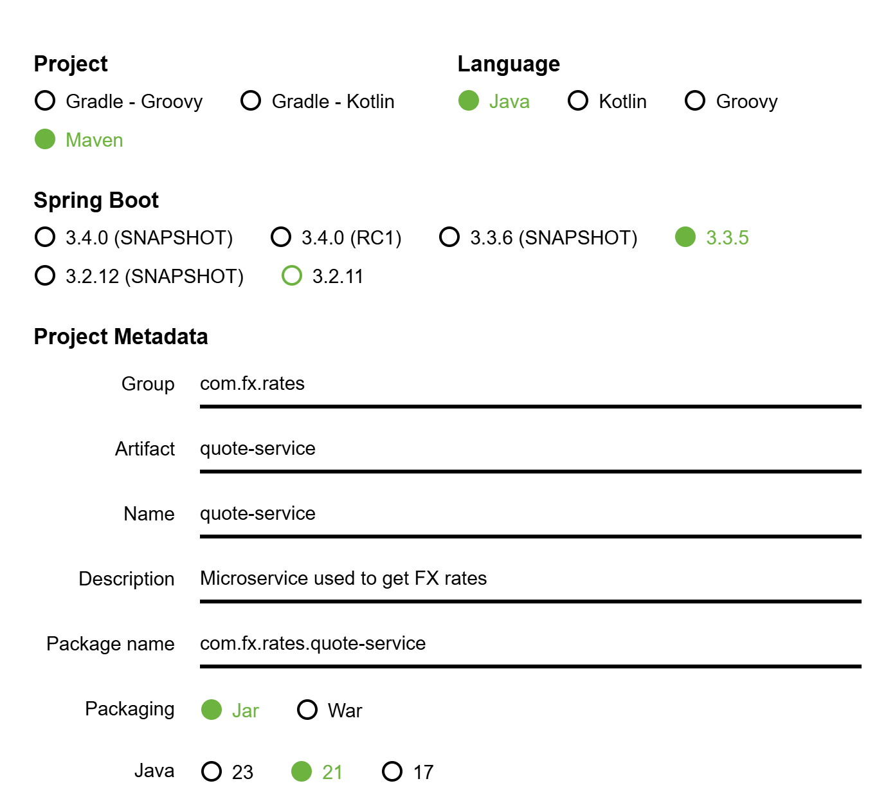

# Backend Development: Quote and FX Trading Microservices



The purpose of this lab is to implement two microservices which will communicate with each other: 
- Quote service, which will return FX rates 
- FX trading service, which will call the Quote service to retrieve FX rates

Before developing the services, you can take a look at the application architecture.



## Pre-requisites
- Java 21
- Maven
- Postman
- IntelliJ IDEA

## Table of contents

- [Exercise 1 - Create project](#exercise-1---create-project)
- [Exercise 2 - Currency enum and RateDto](#exercise-2---currency-enum-and-ratedto)
- [Exercise 3 - Create controller](#exercise-3---create-controller)
- [Exercise 4 - Create service](#exercise-4---create-service)
- [Exercise 5 - Check](#exercise-5---check)
- [Exercise 6 - Importing initial project setup in IDE](#exercise-6)
- [Exercise 7 - Database Setup](#exercise-7)
- [Exercise 8 - Implement REST endpoint for displaying list of all trades](#exercise-8)
- [Exercise 9 - Implement functionality for saving trades](#exercise-9)

## Exercise 1 - Create project

Use [Spring Initializr](https://start.spring.io) to create a new project which has the same parameters as those defined in the following image. 
Add Spring Web as dependency and generate the project. After the project was generated, open it using IntelliJ IDEA.



## Exercise 2 - Currency enum and RateDto

Create an enumeration for currencies (Currency). 
Add a label for each element using the constructor (https://www.baeldung.com/java-enum-values &rarr; 3. Adding a Constructor and a Final Field).

```Java
package com.fx.rates.quote_service;

public enum Currency {
    // TODO Add EUR, RON, GBP, USD currencies
    
    // TODO Add label property
    
    // TODO Add constructor with label property as parameter
}
```


Create RateDto class

```Java
package com.fx.rates.quote_service;

public class RateDto {
    // TODO Add buyRate, sellRate, timestamp fields
    
    // TODO Add constructor
    
    // TODO Add getters and setters
}
```


## Exercise 3 - Create controller

Create the FxRateController class. The controller should have 2 endpoints:
- one for getting the available currencies: /currencies
- one for getting fx-rates for a currency pair: /fx-rate

For the second endpoint you should also include 2 query parameters: primaryCcy and secondaryCcy. Those parameters can be extracted using the @RequestParam annotation.
Hints:
- https://howtodoinjava.com/spring5/webmvc/controller-getmapping-postmapping/ &rarr; 2. Spring @GetMapping Example
- https://www.baeldung.com/spring-request-param


```Java
package com.fx.rates.quote_service;

@RestController
public class FxRateController {
    // TODO getCurrencies
    // hint: List.of(ENUM.values())
    // return List<Currency>

    // TODO getRate; primaryCcy, secondaryCcy are the request parameters
    // return RateDto
}
```

## Exercise 4 - Create service

We will define a map with FX rates for each currency. Those maps will be included in a map which contains all rates.
Add quote logic in a new class - FxRateService. Inject this service class in the controller, to be able to use the getRate method.

```Java
package com.fx.rates.quote_service;

@Service
public class FxRateService {
    
    private static final Map<Currency, Map<Currency, Double>> RATES = new HashMap<>();
    private static final Map<Currency, Double> EUR_RATES = new HashMap<>();
    private static final Map<Currency, Double> USD_RATES = new HashMap<>();
    private static final Map<Currency, Double> GBP_RATES = new HashMap<>();
    private static final Map<Currency, Double> RON_RATES = new HashMap<>();

    // Static blocks are used for initializing the static variables.
    // This block gets executed when the class is loaded in the memory.
    // Can we have more than one?
    static {
        EUR_RATES.put(Currency.GBP, 0.9);
        EUR_RATES.put(Currency.USD, 1.18);
        EUR_RATES.put(Currency.RON, 4.66);
        EUR_RATES.put(Currency.EUR, 1.0);
        RATES.put(Currency.EUR, EUR_RATES);

        // TODO Add some rates for other currencies
    }

    public RateDto getRate(String fromCcyStr, String toCcyStr) {
        Currency fromCcy = Currency.getByLabel(fromCcyStr.toUpperCase());
        Currency toCcy = Currency.getByLabel(toCcyStr.toUpperCase());

        // received unknown currencies
        if (fromCcy == null || toCcy == null) {
            return null;
        }

        Map<Currency, Double> fromRates = RATES.get(fromCcy);
        Double baseRate = fromRates.get(toCcy);

        // received unknown currency pair
        if (baseRate == null) {
            return null;
        }

        double buyRate = baseRate != 1 ? baseRate + getRandomizedDelta(0, baseRate) : 1;
        double sellRate = baseRate != 1 ? baseRate - getRandomizedDelta(0.1, baseRate) : 1;

        return new RateDto(buyRate, sellRate, new Date());
    }

    private static double getRandomizedDelta(double min, double max) {
        // TODO Generate a random number between min and max 
    }
}
```

<br>Add missing code to Currency class
```JAVA
    static {
        for (Currency currency : Currency.values()) {
            MAP.put(currency.getLabel(), currency);
        }
    }

    public String getLabel() {
        return label;
    }

    public static Currency getByLabel(String label) {
        return MAP.get(label);
    }
```

## Exercise 5 - Check

Set the server port in the application.properties file (can be found in the resources directory).
```
spring.application.name=quote-service
server.port=8220
```

Start the app and then use Postman to test the quote-service:
- get the available currencies: localhost:8220/currencies
- get some fx-rates: localhost:8220/fx-rate?primaryCcy=USD&secondaryCcy=EUR


## <a name="exercise-6">Exercise 6 - Importing initial project setup in IDE </a>

Import in the IDE the [starter project](https://github.com/webtoknow/fx-trading-app/blob/master/04_Backend_Development/Exercise/fx-trading-starter.zip).
It should be imported as a Maven project.

Notes:
1. Under *fx_trading* package there is the main class of the Spring Boot application: FxTradingApplication
2. The pom.xml file contains the required Maven dependencies: Spring Web, Spring JPA, PostgreSQL, etc
3. Properties are set in /src/main/resources/application.properties. 
For example: Tomcat server is defined to run on port 8210 by setting property *server.port*  
Also database properties are set. The database properties must match the database setup done in the next exercise.

## <a name="exercise-7">Exercise 7 - Database Setup </a>

For this exercise do the following below with the help of the commands found in db_setup.sql

1. Create a database named **fxtrading**
2. Create the **transactions** table on the above database
3. Create user **fxuser** and grant him rights on fxtrading database and associated tables and sequences
4. Insert dummy test data in the transactions table


Notes:
1. Database connection properties are already set in /src/main/resources/application.properties. 
They are used by Spring to connect to the Postgresql database:
```
spring.datasource.url=jdbc:postgresql://<DATABASE_HOST>:<DATABASE_PORT>/<DATABASE_NAME>
spring.datasource.username=<VALUE>
spring.datasource.password=<VALUE>
```

## <a name="exercise-8">Exercise 8 - Implement REST endpoint for displaying list of all trades </a>

For this exercise we will need to create (guidance below):
1. a Hibernate @Entity class that maps to the *transactions* table
2. a TransactionResponse class that will be used to serialize/deserialize data going through the @RestController (which will be created after)
3. a TransactionMapper mapstruct interface that will be used to convert between entities and response objects
4. a @Repository interface extending JpaRepository
5. a @Service class
6. a @RestController class

Indications:

1.  Under *fx_trading* in package *entity*  
Create the entity class Transaction that maps to transactions table:

```Java
package com.banking.sofware.design.fx_trading.entity;

import jakarta.persistence.Column;
import jakarta.persistence.Entity;
import jakarta.persistence.GeneratedValue;
import jakarta.persistence.GenerationType;
import jakarta.persistence.Id;

import java.math.BigDecimal;
import java.util.Date;


@Entity(name = "Transactions")
public class Transaction {

    @Id
    @GeneratedValue(strategy = GenerationType.IDENTITY)
    private BigDecimal id;

    @Column
    private String username;

    @Column
    private String primaryCcy;

    @Column
    private String secondaryCcy;

    @Column
    private BigDecimal rate;

    @Column
    private String action;

    @Column
    private BigDecimal notional;

    @Column
    private String tenor;

    @Column
    private Date date;

    //TODO: Generate getters and setters

}
```

2. Under *fx_trading* in package *response*.  
Create class TransactionResponse  

We use this object to serialize/deserialize REST message payloads.  
It is a practice to use a distinct set of objects (from entities) when communicating through the REST interface.  
These objects help us as we might want for example to either hide, aggregate or transform information coming from database entities.  

In our case we transform the rate and date fields as detailed in the below step.


```Java
package com.banking.sofware.design.fx_trading.response;

import java.math.BigDecimal;

public class TransactionResponse {

  private BigDecimal id;

  private String username;

  private String primaryCcy;

  private String secondaryCcy;

  private BigDecimal rate;

  private String action;

  private BigDecimal notional;

  private String tenor;

  private Long date;
  
  //TODO: Generate getters and setters
  
}
```

3. a
As an example of data transformation, in this microservice the rates are stored as integer numbers in the database.  
This microservice will use only the first four decimal places of FX rates.  
The rates will need to be converted from decimal to integers and vice versa when needed.   
For conversion, we will multiply or divide with a constant of 10000 defined in a constant class  .

In package *util* under *fx_trading*  
Add class RateUtil:  

```Java
package com.banking.sofware.design.fx_trading.util;

import java.math.BigDecimal;

//question: why use final? 
public final class RateUtil {

  //question: why use private?
  private RateUtil() { }

  public static final BigDecimal RATE_MULTIPLIER = BigDecimal.valueOf(10000);

}
```

3. b
In *fx_trading* in package *mapper*.
Add to it a new class named TransactionMapper  
**You have to write the return statements (one line each) as indicated by the TODO comments**  

```Java
package com.banking.sofware.design.fx_trading.mapper;

import com.banking.sofware.design.fx_trading.entity.Transaction;
import com.banking.sofware.design.fx_trading.response.TransactionResponse;
import com.banking.sofware.design.fx_trading.util.RateUtil;
import org.mapstruct.Mapper;
import org.mapstruct.Mapping;
import org.mapstruct.Named;
import org.mapstruct.factory.Mappers;

import java.math.BigDecimal;
import java.util.Date;

@Mapper(imports = {RateUtil.class, Date.class})
public interface TransactionMapper {
    TransactionMapper INSTANCE = Mappers.getMapper( TransactionMapper.class );

    @Mapping(qualifiedByName = "convertRateForTransfer", target = "rate")
    @Mapping(qualifiedByName = "convertDateToLong", target = "date")
    TransactionResponse transactionToTransactionResponse(Transaction transaction);

    @Named("convertRateForTransfer")
    default BigDecimal convertRateForTransfer(BigDecimal rate) {
        // TODO: get rate from transaction object and divide it by RATE_MULTIPLIER. Hint: Use *divide* method from BigDecimal
        //return rate.
    }

    @Named("convertDateToLong")
    default Long convertDateToLong(Date date) {
        //TODO: get date field from transaction and convert it to long using method from Date API
        /**
         * Notice: the date object can't be null as it is a mandatory database field.
         * but if an entity field can be null we need to take care at conversion to
         * avoid Null Pointer Exception
         **/
        //return date.
    }
}
```


4. In package *repository* under *fx_trading* add:

```Java
package com.banking.sofware.design.fx_trading.repository;

import java.math.BigDecimal;

import org.springframework.data.jpa.repository.JpaRepository;
import org.springframework.stereotype.Repository;

import com.banking.sofware.design.fx_trading.entity.Transaction;

@Repository
public interface FxTradingRepository extends JpaRepository<Transaction, BigDecimal> {

}
```


5. Under *fx_trading* in package *service* add:

```Java
package com.banking.sofware.design.fx_trading.service;

import com.banking.sofware.design.fx_trading.mapper.TransactionMapper;
import com.banking.sofware.design.fx_trading.repository.FxTradingRepository;
import com.banking.sofware.design.fx_trading.response.TransactionResponse;
import org.springframework.beans.factory.annotation.Autowired;
import org.springframework.stereotype.Service;

import java.util.List;
import java.util.stream.Collectors;

@Service
public class FxTradingService {

    @Autowired
    private FxTradingRepository repository;

    @SuppressWarnings("unchecked")
    public List<TransactionResponse> getTransactions() {
        return repository.findAll().stream().map(TransactionMapper.INSTANCE::transactionToTransactionResponse).collect(Collectors.toList());
    }

}
```

6. In package *rest* under *fx_trading* add the REST controller below

```Java
package com.banking.sofware.design.fx_trading.rest;

import com.banking.sofware.design.fx_trading.response.TransactionResponse;
import com.banking.sofware.design.fx_trading.service.FxTradingService;
import jakarta.servlet.http.HttpServletResponse;
import org.springframework.beans.factory.annotation.Autowired;
import org.springframework.web.bind.annotation.*;

import java.util.List;

@RestController
@RequestMapping("/transaction")
public class FxTradingRestController {

    @Autowired
    private FxTradingService tradingService;

    @CrossOrigin
    @GetMapping(produces = "application/json")
    public List<TransactionResponse> getTransactions(HttpServletResponse response) {
        try {
            return tradingService.getTransactions();
        } catch (Exception e) {
            response.setStatus(500);
            return null;
        }
    }

}
```

After completing steps 1-6 of exercise 8 you should have a working REST endpoint for listing all trades.
It can now be tested with a tool like Postman
 

## <a name="exercise-9">Exercise 9 - Implement functionality for saving trades </a>

Since we cannot trust the exchange rate coming from the frontend (can be trivially changed) we will call the quote service to provide us with the rate.

1. Let's create a service that obtains the quotation from the quote service

In package *service* add class QuoteProxyService

```Java
package com.banking.sofware.design.fx_trading.service;

import com.banking.sofware.design.fx_trading.dto.QuoteResponse;
import org.springframework.beans.factory.annotation.Value;
import org.springframework.stereotype.Service;
import org.springframework.web.client.RestTemplate;

@Service
public class QuoteProxyService {

    @Value("${fxrates.url}")
    private String fxratesUrl;

    public QuoteResponse getRate(String primaryCcy, String secondaryCcy) {

        RestTemplate restTemplate = new RestTemplate();

        StringBuilder sb = new StringBuilder(fxratesUrl);
        sb = sb.append("?primaryCcy=").append(primaryCcy);
        sb = sb.append("&secondaryCcy=").append(secondaryCcy);

        return restTemplate.getForObject(sb.toString(), QuoteResponse.class);
    }

}
```

We also need to add a simple Java object that will contain the deserialized response.  
In package *dto* under *fx_trading* add class QuoteResponse.  

```Java
package com.banking.sofware.design.fx_trading.dto;

import java.math.BigDecimal;

import com.fasterxml.jackson.annotation.JsonIgnoreProperties;

@JsonIgnoreProperties(ignoreUnknown = true)
public class QuoteResponse {

    private BigDecimal buyRate;
    private BigDecimal sellRate;

    public QuoteResponse() {

    }

    public QuoteResponse(BigDecimal buyRate, BigDecimal sellRate) {
        this.buyRate = buyRate;
        this.sellRate = sellRate;
    }

    // TODO: add getters and setters

}
```

Notice we added explicitly the no-args constructor and also added a constructor with parameters. 
The second one is created for convenience for unit testing.  
If the first one is missing then the deserialization will fail.  

2. In FxTradingService add the following methods and fields  
*Note*: you have to add missing imports (import from Spring framework and Apache Commons Lang3 and org.slf4j)

```Java
    private Logger logger = LoggerFactory.getLogger(FxTradingService.class);
    
    @Autowired
    private QuoteProxyService proxyRatesService;
    

    @Transactional
    public void makeTransaction(TransactionResponse dto) {
        // Important: in a real application validations should be made - here for example
        String action = dto.getAction();
        if (StringUtils.isBlank(action) || !Arrays.asList("BUY", "SELL").contains(action.toUpperCase())) {
            throw new IllegalArgumentException("Action not supported!");
        }
    
        QuoteResponse ratePair = getCurrentRate(dto.getPrimaryCcy(), dto.getSecondaryCcy());
        BigDecimal rate = "BUY".equalsIgnoreCase(action) ? ratePair.getBuyRate() : ratePair.getSellRate();
    
        Transaction transaction = TransactionMapper.INSTANCE.transactionResponseToTransaction(dto,rate);
        repository.save(transaction);
    }
    
    private QuoteResponse getCurrentRate(String primaryCcy, String secondaryCcy) {
        try {
            return proxyRatesService.getRate(primaryCcy, secondaryCcy);
        } catch (Exception e) {
            logger.error("Could not obtain response from quote service!", e);
            throw e;
        }
    }
```

In TransactionMapper add the following methods:

```Java
    @Mapping(qualifiedByName = "convertRateForPersisting", target = "rate", source = "rate")
    @Mapping(expression = "java(new Date())", target = "date")
    Transaction transactionResponseToTransaction(TransactionResponse transactionResponse, BigDecimal rate);


    @Named("convertRateForPersisting")
    default BigDecimal convertRateForPersisting(BigDecimal rate) {
        return rate.multiply(RateUtil.RATE_MULTIPLIER).setScale(0, RoundingMode.HALF_UP);
    }
```


3. In FxTradingRestController add the following method:

```Java
    @CrossOrigin
    @RequestMapping(method = RequestMethod.POST, consumes = "application/json")
    public void makeTransaction(@RequestBody TransactionResponse transaction, HttpServletResponse response) {
        try {
            tradingService.makeTransaction(transaction);
        } catch (Exception e) {
            response.setStatus(500);
        }
    }
```
  
**Important**: for this functionality to work this microservice has to connect to a live quote service.

Now the implementation for the creation of trades should be done, and you can test it with a tool like Postman.