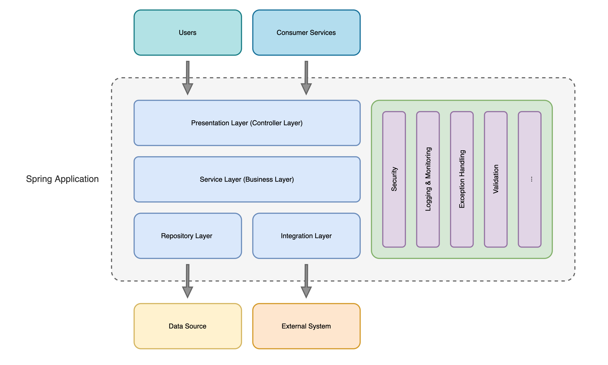
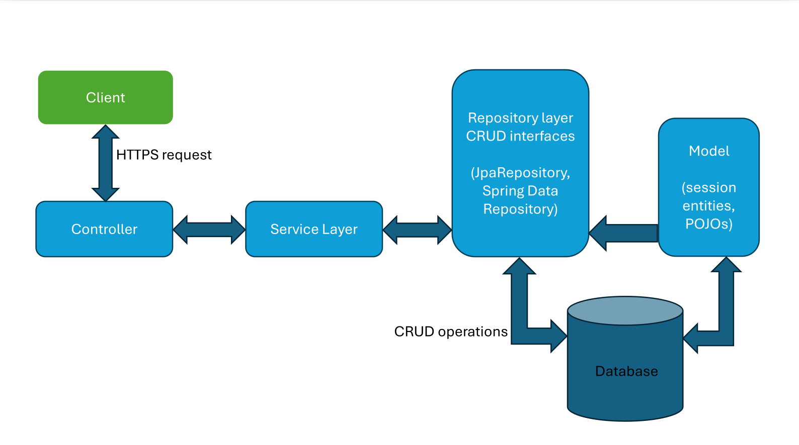

# Backend Development: Server-side programming


## Client-Server


## 1. Web servers

- Store software and website components files, such as HTML, JavaScript, CSS files.
- Contain HTTP server - software component serving client requests using URLs and HTTP protocol.  
- Can be accessed via Internet by other devices.
- Can serve static or dynamic content.

**Why are they used?**
- retrieve multimedia data from a database to display it in a user interface
- validate user input data and store it in a database
- log users in and validate user permissions
  
  
<a href="https://developer.mozilla.org/en-US/docs/Learn/Server-side">Server Side Basics</a>

## 2.1 HTTP protocol

HTTP is a client-server, request-response protocol.  
An HTTP message contains a list of headers and in some of the cases a message body.  
For example if the server provides cookies to the client it will include a header named *Cookie*.  
There is a list of predefined HTTP headers, and you can add custom headers to your HTTP responses.

<a href="https://developer.mozilla.org/en-US/docs/Web/HTTP/Messages">HTTP Messages</a>

In the body, you can send large JSON files, or XML files for legacy applications.

## 2.2 HTTP methods

Most common ones:  
- GET  
- POST  
- PUT  
- DELETE   

<a href="https://developer.mozilla.org/en-US/docs/Web/HTTP/Methods">Details</a>  

## 2.3 HTTP status codes  

200 OK   
3xx Redirection  
4xx Client error  
5xx Server error  

<a href="https://en.wikipedia.org/wiki/List_of_HTTP_status_codes">More information</a>  

## 3. REST (Representational State Transfer)  

REST is a set of conventions used to separate the concerns of the client and server when creating web services.
Systems compliant to this paradigm are called RESTful, and they are stateless (client and server do not need to know anything about each other's state).
REST uses resources to describe any object, document, or thing that you may need to retrieve, store or send to other services.

REST requires a client to make a request to the server in order to retrieve or modify data on the server.
A request generally consists of:
- an HTTP verb, which defines what kind of operation to perform
- a header, which allows the client to pass along information about the request
- a path to a resource
- an optional message body containing data

So for example:
- GET will be used to retrieve a specific resource (by id) or a collection of resources
- POST will be used to create a new resource
- PUT will be used to update a specific resource (by id)
- DELETE will be used to remove a specific resource by id

These operations listed above are commonly called CRUD (Create/Read/Update/Delete).

A very good dive into learning more about REST is an article from Martin Fowler describing the Richardson Maturity Model:
<a href="https://martinfowler.com/articles/richardsonMaturityModel.html">Link to Richardson Maturity Model</a>


## 4.1 Inversion of Control and Dependency Injection

**Inversion of Control** is a principle in software engineering which refers to transferring the control over the flow of a program’s execution to a framework or a container.
Thus, the container will manage the dependencies and their lifecycles and will provide them whenever they are needed in an IoC application.

Advantages of IoC:
- task execution is decoupled from task implementation
- greater abstraction, leading to easy switch between different providers
  - for instance, when switching an application database from _Postgresql_ to _Oracle_, a programmer only has to change configuration in order to change the database provider, no code change required. Of course, this is possible only because we are still in the SQL world.
- greater modularity of a program
- code is easier to test, by mocking dependencies and allowing components to communicate through contracts

IoC can be achieved through various mechanisms, such as: Strategy design pattern, Service Locator pattern, Factory pattern, and Dependency Injection (DI).
The most common way is through Dependency Injection

**Dependency Injection** is a design pattern used to implements IoC.
Connecting objects with other objects, or “injecting” objects into other objects, is done by an assembler rather than by the objects themselves.

Example - traditional programming:
```Java
public class Store {
   private Item item;
    
   public Store() {
      item = new ItemImpl1();    
   }
}
```

Example - using DI:
```Java
public class Store {
   private Item item;
   
   public Store(Item item) {
      this.item = item;
   }
}
```

Now, using DI, the store object simply declares that it needs an item, via a constructor. You can declare you need an object via DI with constructor, setter or simply via a field that is annotated with a special annotation.
The IoC container is smart enough to use reflection or whatever means to provide an instance to a specific field. 

Exercise: which way do you think it is the recommended way to declare a dependency?

An IoC container is a common characteristic of frameworks that provide dependency injection.


## 4.2 Spring / Spring Boot



**Spring** is a framework providing a comprehensive programming and configuration model for modern Java-based enterprise applications - on any kind of deployment platform.

It separates the construction of objects from the logic that uses them. The Spring container doesn't manage only the construction of objects, but also their entire lifecycle, until destruction. 
It comes with features like Dependency Injection, and out of the box modules like:

- Spring JDBC
- Spring MVC
- Spring Security
- Spring AOP
- Spring ORM
- Spring Test

Beans are the objects managed by Spring IoC container. The context is the engine of Spring, where beans reside. It is also responsible for wiring everything together, for instance to create first the 
dependency tree, and then providing the instances as they are required.

`@Autowired` is an annotation specific to Spring. The Spring IoC container has annotation processors, that are handling specific annotations at runtime. Therefore, when the application starts, it looks 
for the `@SpringBootApplication` annotation or others (if only using Spring instead of Spring Boot), in order to know where to scan the beans and these annotations, to finally build the dependency graph.


**Spring Boot** is an extension of the Spring framework, which eliminates the boilerplate configurations required for setting up a Spring application.

Spring Boot features:
- starter dependencies to simplify the build and application configuration
- embedded server to avoid complexity in application deployment
- metrics, health check, and externalized configuration
- automatic configuration for Spring functionality, whenever possible
- simpler annotations, like `@SpringBootApplication`, automatically scanning the current package and auto-configuring using default configurations

To enable component scanning and autoconfiguration of beans in Spring Boot, the main method should be annotated with `@SpringBootApplication`.

```Java
@SpringBootApplication
public class DemoApplication {
    public static void main(String[] args) {
        SpringApplication.run(DemoApplication.class, args);
    }
}
```

If we dive into the spring boot main annotation above, we see:

```Java
@Target({ElementType.TYPE})
@Retention(RetentionPolicy.RUNTIME)
@Documented
@Inherited
@SpringBootConfiguration
@EnableAutoConfiguration
@ComponentScan
```

This annotation exists to simplify even further the development effort. However, if default configurations do not serve the programmer's needs, we still have to define our own configurations.


## 4.3 Spring MVC



Spring MVC lets you create special annotated beans to handle incoming HTTP requests.
To enable Spring MVC support through a Java configuration class, we just add the @EnableWebMvc annotation:
```Java
@EnableWebMvc
@Configuration
public class WebConfig {

    /// ...
}
```

## Controller
Controller classes contain endpoints - the access points from which an outside system, also called a client, can interact with our application. 
The endpoints receive requests from the client systems, and pass the requests to service classes which execute the business logic. 

In a way of speaking, we can look at controllers as backend delegators of client requests to the service or business layers of the application.

Outside System ------> [Controller -> Service -> Repository] ------> Database

```Java
@Controller
@RequestMapping("/users")
public class UserController {
    private final UserService userService;

    @Autowired
    public UserController(UserService userService) {
        this.userService = userService;
    }

    @GetMapping("/{id}")
    public ResponseEntity<User> getUserById(@PathVariable Long id) {
        User user = userService.getUserById(id);
        return ResponseEntity.ok(user);
    }
}
```

## Service
Service classes contain the business related logic - which might include retrieving, modifying or deleting data. In these service beans we find the transactional boundary of the system. This means 
we can have a set of related and atomic database operations, or a transaction, defined in a single method of the service bean.

Usually the service class needs information from the database or changes information into the database when performing an operation, so the service classes directly interact with repository classes.

```Java
@Service
public class UserService {
    private final UserRepository userRepository;

    @Autowired
    public UserService(UserRepository userRepository) {
        this.userRepository = userRepository;
    }
    
    public User getUserById(Long id) {
        return userRepository.findByUserId(id);
    }
}
```

## Repository
Repository classes contain the interactions with the database. 
Actions can be either adding new data in the database (register a new user) or retrieving data from the database (finding and existing user).

Spring Data provides an interface called JpaRepository, used for extending the CRUD interface.
It allows implementing custom database queries, and provides some out of the box methods, such as:
- findAll, findById, findOne
- count, exists, existsById
- save
- delete, deleteAll, deleteAll, deleteById
- deleteAllInBatch, deleteInBatch(Iterable<T> entities)

```Java
@Repository
public interface UserRepository extends JpaRepository<User, Long> {
    public User findByUserId(Long userId);

    @Query("SELECT u FROM User u WHERE u.userName = ?1 and u.password = ?2")
    public User findUserByStatusAndName(String userName, String password);
}
```

## Entities
Entity classes are part of Spring Data, and they represent mappings between Java classes and database tables.
Members of entity classes are mapped to columns in the database.

```Java
@Data
@Builder
@NoArgsConstructor
@AllArgsConstructor
@Entity
@Table(name = "user_login")
public class UserLogin {

    @Id
    @GeneratedValue(strategy = GenerationType.IDENTITY)
    @Column(name = "user_login_id", updatable = false, nullable = false)
    private Long userLoginId;

    @ManyToOne(fetch = FetchType.LAZY)
    @JoinColumn(name = "user_id")
    private User user;

    @Column(name = "token")
    private String token;

    @Column(name = "token_expire_time")
    private String tokenExpireTime;

}
```

## 4.4 REST client
RestClient is a synchronous HTTP client, which sends and receives HTTP requests and responses in a blocking manner, meaning it waits for each request to complete before proceeding to the next one.
RestClient can be used to communicate service-to-service, using HTTP calls.

```Java
RestClient restClient = RestClient.create();
String result = restClient.get()
        .uri(uriBase + "/users/123")
        .retrieve()
        .body(String.class);

User user = new User(124, "John");
ResponseEntity<Void> response = restClient.post()
        .uri(uriBase + "/users")
        .contentType(APPLICATION_JSON)
        .body(user)
        .retrieve()
        .toBodilessEntity();
```

## 4.5 Cross-cutting concerns

Certain features that are not part of the core business logic become necessary, as the application grows, and are called cross-cutting concerns.
Examples of cross-cutting concerns are:

- Logging: recording method call or argument or execution time (for performance check)
- Security: verifying if the current user has a permission to execute a method
- Caching: storing the result of expensive method calls for fast retrieval

Spring uses Aspect-Oriented-Programming to modularize these cross-cutting concerns.

## 4.6 Spring AOP examples 

### Declarative transaction management

Without Spring. handling transactions would involve `connection.commit` and `connection.rollback` calls.
With Spring, putting the following annotation is enough:

```Java
    @Transactional
    public void transferFunds(long fromId, long toId, BigDecimal amount) {
        // Core business logic (no manual transaction code needed!)
        accountRepository.withdraw(fromId, amount);
        accountRepository.deposit(toId, amount); 
    }
```


## 5.1 Maven: The Foundation of Enterprise Java

The Problem: Ending "JAR Hell"

Before Maven, managing external Java libraries (JAR files) was chaotic:

Manual Download: You had to manually find and download every required JAR (e.g., for logging, testing, or database drivers).

Transitive Dependencies: If your logging library (A) needed another library (B) to work, you also had to find, download, and manage library B. This chain reaction was known as "JAR Hell."

Inconsistent Builds: Every project used different custom scripts (like Ant) for building, compiling, and testing, making it hard for new developers to jump in.

Maven’s solution is to centralize project knowledge and automate the logistics. It defines a process so repeatable that you can build a massive application with a single command.

## 5.2 Pillar 1: Dependency Management via the POM

The most powerful feature of Maven is its dependency management system, centered around the Project Object Model (POM).

### The pom.xml File

The pom.xml is an XML file that sits at the root of your project and is the single source of truth for all project configurations, properties, and, most importantly, dependencies.

You Declare: You simply declare the project name, group ID, artifact ID, and the version of the libraries you need.

Maven Handles: Maven automatically connects to the Maven Central Repository (a massive public server of artifacts) and downloads the required JARs and all their sub-dependencies.

By adding just these few lines, Maven handles finding and integrating the entire Spring Boot ecosystem:

```xml
<dependencies>
    <dependency>
        <groupId>org.springframework.boot</groupId>
        <artifactId>spring-boot-starter-web</artifactId>
        <version>3.2.0</version>
    </dependency>
</dependencies>

```

## 5.3 Pillar 2: The Standard Build Lifecycle

Maven enforces a predictable and standardized sequence of steps called the Build Lifecycle. 
When you tell Maven to execute a phase, it executes all preceding phases automatically.

- mvn validate
- mvn compile
- mvn test
- mvn package
- mvn install
- mvn deploy

## 5.4 Pillar 3: Convention Over Configuration (CoC)

CoC means Maven assumes your project follows the Standard Directory Layout. By imposing this consistent structure, 
Maven can perform its tasks without you having to configure file paths explicitly.

- src/main/java
- src/main/resources
- src/test/java
- src/test/resources

## 5.5 Conclusion

Maven is the backbone of modern Java development. It transforms a scattered collection of files and dependencies into a 
fully managed, standardized, and professionally structured project.
By learning Maven, you're not just learning a tool; you're learning the fundamental structure required for enterprise software engineering.