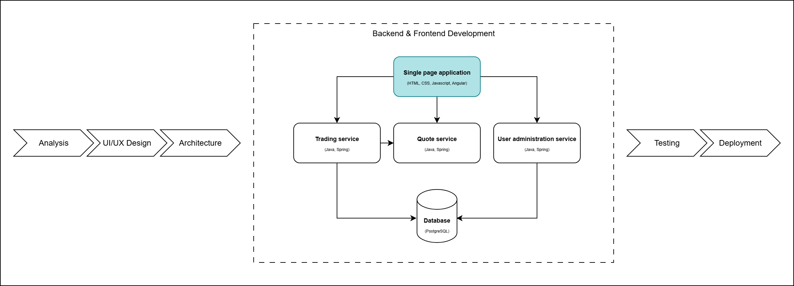

# Frontend Development: Create Login and Register Pages with Angular



For this tutorial to work, it's essential to have Node.js, npm, and the Angular CLI installed on your machine. Node.js enables server-side JavaScript execution, while npm helps manage project dependencies. The Angular CLI is a command-line tool that simplifies the development of Angular applications. If you haven't installed these yet, you can download Node.js and npm from the official  [Node.js](https://nodejs.org/) website and install the [Angular CLI](https://angular.dev/installation#install-angular-cli) using npm.

**IMPORTANT**: Make sure you have Angular CLI version 18 installed globally to avoid compatibility issues with the commands used in this tutorial. You can install it using:

```bash
npm install -g @angular/cli@18
```

To verify your Angular CLI version, run:

```bash
ng version
```

If you missed last week's session, you'll also need to install [Git](https://git-scm.com/) and clone the project repository using the command below, or download it directly from GitHub:

```bash
git clone https://github.com/webtoknow/fx-trading-app.git
```

## Table of contents
- [Exercise 0 - Configure and start Mock Server](#exercise-0---configure-and-start-mock-server)
- [Exercise 0.1 - Configure UI Reverse Proxy](#exercise-01---configure-ui-reverse-proxy)
- [Exercise 1 - Pages, Routing and Navigation](#exercise-1---pages-routing-and-navigation)
  - [Create pages](#create-pages)
  - [Add routes](#add-routes)
  - [Add Toastr](#add-toastr)
  - [Fill in global style file](#fill-in-global-style-file)
  - [Add Bootstrap, Datepicker and Fontawesome](#add-bootstrap-datepicker-and-fontawesome)
- [Exercise 2 - Register page](#exercise-2---register-page)
  - [User model](#user-model)
  - [Constants file](#constants-file)
  - [User service](#user-service)
  - [Update Application Module](#update-application-module)
  - [Register component](#register-component)
- [Exercise 3 - Login page](#exercise-3---login-page)
  - [Authentication service](#authentication-service)
  - [Authentication guard](#authentication-guard)
  - [JWT Interceptor](#jwt-interceptor)
  - [Error Interceptor](#error-interceptor)
  - [Update Application Module with the new added classes](#update-application-module-with-the-new-added-classes)
  - [Login component](#login-component)
- [Exercise 4 - Not found page](#exercise-4---not-found-page)

## Exercise 0 - Configure and start Mock Server

Mock server is used to create a fake API to mock the backend data using [JSON Server](https://github.com/typicode/json-server).

Let's install its packages:

```bash
cd fx-trading-app\06_Frontend_Development\Exercise\Code\mock-server
npm install
```

### Option 1: Start mock server from mock-server directory

Navigate to the mock-server folder and start all microservices:

```bash
cd fx-trading-app\06_Frontend_Development\Exercise\Code\mock-server
npm start
```

### Option 2: Add npm script to start mock server from UI folder

For convenience, you can add an npm script to your **ui/package.json** that allows you to start the mock server from the UI folder:

```json
"scripts": {
  "ng": "ng",
  "start": "ng serve",
  "start:mock": "cd ../../mock-server && npm start",
  "build": "ng build",
  ...
}
```

Then you can start the mock server from the **ui/** folder:

```bash
cd fx-trading-app\06_Frontend_Development\Exercise\Code\ui
npm run start:mock
```

Now we can access these APIs:

- `http://localhost:8200/user/authenticate` - sign-in
- `http://localhost:8200/user/register` - register
- `http://localhost:8210/transactions` - get all transactions
- `http://localhost:8220/currencies` - get all currencies
- `http://localhost:8220/fx-rate` - get fx rates for specific currencies

**Note**: The Mock Server serves as a backup solution for local development when the backend services are not available. For integration with the real backend services, proceed to Exercise 0.1 below.

## Exercise 0.1 - Configure UI Reverse Proxy

When integrating the frontend with the real backend services (from the Backend Development sessions), we need to configure a reverse proxy to avoid CORS issues during local development. This is the **primary integration method** when working with the actual backend microservices (from a different domain).

Even though CORS is explicitly allowed in the backend security configuration, some browsers might still block cross-origin requests. The proxy server intercepts frontend requests and forwards them to the backend services, bypassing these restrictions.

### Step 1: Create proxy configuration file

Create a file called **proxy.conf.json** under the **ui/** folder with the following content:

```json
{
    "/auth": {
        "target": "http://localhost:8200",
        "secure": false,
        "changeOrigin": true,
        "logLevel": "debug",
        "pathRewrite": {
            "^/auth": ""
        }
    },
    "/trade": {
        "target": "http://localhost:8210",
        "secure": false,
        "changeOrigin": true,
        "logLevel": "debug",
        "pathRewrite": {
            "^/trade": ""
        }
    },
    "/quote": {
        "target": "http://localhost:8220",
        "secure": false,
        "changeOrigin": true,
        "logLevel": "debug",
        "pathRewrite": {
            "^/quote": ""
        }
    }
}
```

**Explanation**:
This configuration intercepts requests made to specific paths like `/auth`, `/trade`, and `/quote` and forwards them to the corresponding backend services running on different ports:
- `/auth` → http://localhost:8200 (User Administration Service)
- `/trade` → http://localhost:8210 (FX Trading Service)
- `/quote` → http://localhost:8220 (Quote Service)

The **pathRewrite** option ensures the backend receives requests without the initial path prefixes, while **changeOrigin: true** adjusts the request headers for proper routing.

_Remember, this is primarily for development; production environments require proper CORS configuration on the backend for security._

### Step 2: Configure the UI to use proxy paths

Update the service URLs in the **ui/src/app/constants.ts** file to match the paths from the proxy configuration:

```typescript
export const authApi = '/auth';
export const tradeApi = '/trade';
export const quoteApi = '/quote';
```

_For simplicity, we are using a constants file for the service URLs. In a production deployment, these URLs would be determined dynamically based on the target environment, resulting in a more specific configuration process (https://v17.angular.io/guide/build)_

### Step 3: Update the start script

Change the start script in **package.json** to use the proxy configuration:

```json
"start": "ng serve --proxy-config proxy.conf.json"
```

### Step 4: Test the integration

1. Ensure all backend services are running (from Backend Development sessions):
   - User Administration Service on port 8200
   - FX Trading Service on port 8210
   - Quote Service on port 8220

2. Start the UI application:
   ```bash
   npm start
   ```

3. Test the existing flows (login, register) to verify the integration works correctly.

**Alternative**: If the backend services are not available, you can use the Mock Server from Exercise 0 as a fallback by updating the constants.ts file to point directly to the mock server URLs (e.g., `http://localhost:8200`).

## Exercise 1 - Pages, Routing and Navigation

### Create pages

Go to *06_Frontend_Development/Exercise/Code/ui* using a new **terminal** windows:

```bash
cd fx-trading-app\06_Frontend_Development\Exercise\Code\ui
```

> In the `public` directory, you'll find several images, such as `favicon.ico`, as well as the following under the `\assets\img\` folder: `error_404.png`, `logo-grayscale.svg`, and `logo-main.svg`.

Run *npm install* to download all dependencies:

```bash
npm install
```

Create a folder for pages in *ui/src/app*:

```bash
cd src\app
mkdir pages
cd pages
```

Generate page components using CLI:

```bash
ng generate component dashboard-page
ng generate component login-page
ng generate component not-found-page
ng generate component register-page
```

### Add routes

In `app-routing.module`, import all the necessary components to make them available for routing. After that, update the `routes` array by linking each of the components.

```JS
...
import { NgModule } from '@angular/core';
import { RouterModule, Routes } from '@angular/router';
import { LoginPageComponent } from './pages/login-page/login-page.component';
import { RegisterPageComponent } from './pages/register-page/register-page.component';
import { DashboardPageComponent } from './pages/dashboard-page/dashboard-page.component';
import { NotFoundPageComponent } from './pages/not-found-page/not-found-page.component';

const routes: Routes = [
  { path: '', redirectTo: '/login', pathMatch: 'full' },
  { path: 'login', component: LoginPageComponent },
  { path: 'register', component: RegisterPageComponent },
  { path: 'dashboard', component: DashboardPageComponent },
  { path: '**', component: NotFoundPageComponent }
];

@NgModule({
  imports: [RouterModule.forRoot(routes)],
  exports: [RouterModule]
})
export class AppRoutingModule { }
```
Now we need to clean up de project by:
- Removing the startup project markup from *app.component.html* and only keeping `<router-outlet></router-outlet>`.
- Removing `title = 'ui'` from AppComponent in *app.component.ts*.

Great job! 👍👍 Now, let's view your first Angular application by starting the development server in a **terminal** window.

Use the previously opened terminal and ensure you're in the *fx-trading-app\06_Frontend_Development\Exercise\Code\ui* directory. You can navigate to this directory with the following commands:

```bash
cd ..
cd ..
cd ..
```

Once you're in the root folder of your Angular application (*06_Frontend_Development\Exercise\Code\ui*), run:

```bash
npm start
```
After the build process completes in the terminal, you can access the app by opening a browser (such as Chrome) and navigating to `http://localhost:4200/`. You should see the message:

```
login-page works!
```


### Add Toastr

We are using [ngx-toastr](https://github.com/scttcper/ngx-toastr) for notifications. 

Install *ngx-toastr*:

```bash
npm install ngx-toastr@19.0.0
```

In order to load *toast* style, we should update `angular.json`:

```JSON
"styles": [
 "src/styles.css" // already here
  "node_modules/ngx-toastr/toastr.css" // add this
]
```

We also need to update `app.module.ts.ts` by adding `ToastrModule` and ensuring `BrowserAnimationsModule` is included as well:

```JS
import { NgModule } from '@angular/core';
import { BrowserModule } from '@angular/platform-browser';

import { AppRoutingModule } from './app-routing.module';
import { AppComponent } from './app.component';
import { DashboardPageComponent } from './pages/dashboard-page/dashboard-page.component';
import { LoginPageComponent } from './pages/login-page/login-page.component';
import { NotFoundPageComponent } from './pages/not-found-page/not-found-page.component';
import { RegisterPageComponent } from './pages/register-page/register-page.component';
import { BrowserAnimationsModule } from '@angular/platform-browser/animations';
import { ToastrModule } from 'ngx-toastr';

@NgModule({
  declarations: [
    AppComponent,
    DashboardPageComponent,
    LoginPageComponent,
    NotFoundPageComponent,
    RegisterPageComponent
  ],
  imports: [
    BrowserModule,
    AppRoutingModule,
    BrowserAnimationsModule,
    ToastrModule.forRoot()
  ],
  providers: [],
  bootstrap: [AppComponent]
})
export class AppModule { }

```
This will ensure both Toastr notifications and animations are properly configured in the application.

For more information on how to use `ngx-toastr`, you can refer to the official documentation available on [GitHub](https://github.com/scttcper/ngx-toastr). There, you'll find detailed instructions on installation, configuration, and examples of how to display notifications in your Angular application.

To verify that you’ve correctly added `ngx-toastr`, replace the contents of `app.component.ts` with the following code:

```JS
import { Component, OnInit } from '@angular/core';
import { ToastrService } from 'ngx-toastr';

@Component({
  selector: 'app-root',
  templateUrl: './app.component.html',
  styleUrls: ['./app.component.css']
})
export class AppComponent implements OnInit {
  constructor(private toastr: ToastrService) {}

  ngOnInit() {
    this.showSuccess();
  }

  showSuccess() {
    this.toastr.success('Hello world!', 'Toastr fun!');
  }
}
```
After making this change, refresh the browser, and you should see the toastr notification displayed. Please remember to revert the file to its previous state once you’ve completed testing.

### Fill in global style file

Open `styles.css` global style file and fill in with these classes, used in the whole application, not only in one specific component:

```CSS
/* You can add global styles to this file, and also import other style files */

html, body{
    height: 100%;
    color: #373A3C;
    font-family: 'Open Sans', sans-serif;
}

h1,h2,h3,h4,h5,h6 {
    color: #7C7C7C;
}

.btn-primary {
    background-color: #3496F0;
}

.btn-link {
    color: #3496F0;
}
.table-striped tbody tr:nth-of-type(odd) {
    background-color: #F2F2F2;
}

.flex {
    display: flex;
}

.flex-vertical-centered {
    display: flex;
    align-items: center;
}

.title {
    margin-bottom: 30px;
    padding-bottom: 20px;
    font-weight: bold;
}

.title-border {
    border-bottom: 1px solid #DDDDDD;
}

.screen-full-height {
    height: 100vh;
    display: flex;
}

.is-invalid {
  border-left: 5px solid #D9534F;
}
```

### Add Bootstrap, Datepicker and Fontawesome

To incorporate the Open Sans font, Bootstrap styles, and Font Awesome into your project, you'll need to update your `index.html` file with the following CSS and script links. Please add them into `<head>` tag:

```HTML
<link rel="preconnect" href="https://fonts.googleapis.com">
<link rel="preconnect" href="https://fonts.gstatic.com" crossorigin>
<link href="https://fonts.googleapis.com/css2?family=Open+Sans:wght@400;700&display=swap" rel="stylesheet">

<link href="https://cdn.jsdelivr.net/npm/bootstrap@5.2.3/dist/css/bootstrap.min.css" rel="stylesheet" crossorigin="anonymous" integrity="sha384-rbsA2VBKQhggwzxH7pPCaAqO46MgnOM80zW1RWuH61DGLwZJEdK2Kadq2F9CUG65">

<link rel="stylesheet" href="https://stackpath.bootstrapcdn.com/font-awesome/4.7.0/css/font-awesome.min.css">
```

Additionally, install `ngx-bootstrap` by running the following command:

```bash
npm install ngx-bootstrap@18.0.2
```

Link `ngx-bootstrap` by updating `app.module.ts`:

```JavaScript
import { BsDatepickerModule } from 'ngx-bootstrap/datepicker';

imports: [
    ...
    ToastrModule.forRoot(),
    BsDatepickerModule.forRoot()
]
```

In order to load *DatePicker* style, we should update `angular.json`:

```JSON
"styles": [
 "src/styles.css" // already here
  "node_modules/ngx-toastr/toastr.css", // already here
   "node_modules/ngx-bootstrap/datepicker/bs-datepicker.css"
]

## Exercise 2 - Register page

### User model

First, let's create a new folder in *06_Frontend_Development/Exercise/Code/ui/src/app* called **models** to store all the entities we'll need.

From the design of the register page, we can identify the necessary fields for the user:
* id
* username
* email
* password

Next, create a new file named `user.ts` in the models folder and define the following class:

```JavaScript
export class User {
    id: number | null = null;
    username: string = '';
    email: string = '';
    password: string = '';
}
```

### Constants file

To communicate with the backend, we will need to define the necessary APIs. Let's establish how these APIs will be structured.

On the server side, there will be three microservices:

- *authService*, running on port 8200
- *fxTradeService*, running on port 8210
- *quoteService*, running on port 8220

In the directory *06_Frontend_Development/Exercise/Code/ui/src/app*, we will create a new file named `constants.ts`, which will hold all the required API endpoints:


```JavaScript
export const authApi = 'http://localhost:8200'
export const tradeApi = 'http://localhost:8210'
export const quoteApi = 'http://localhost:8220'

export const backendUrl = {
  authService: {
    authenticate: `${authApi}/user/authenticate`,
    register: `${authApi}/user/register`,
  },
  fxTradeService: {
    getTransactions: `${tradeApi}/transactions`,
    saveTransaction: `${tradeApi}/transactions`,
  },
  quoteService: {
    getCurrencies: `${quoteApi}/currencies`,
    getFxRate: `${quoteApi}/fx-rate`
  }
}
```

### User service

Now, let's focus on creating the service to send user details via an HTTP request to the server.

Start by creating a new folder in *06_Frontend_Development/Exercise/Code/ui/src/app* named **services**, which will hold all the services required for different functionalities.

Our first service will be in a file called `user.service.ts`:

```JavaScript
import { Injectable } from '@angular/core';
import { HttpClient } from '@angular/common/http';

import { User } from '../models/user';
import { backendUrl } from '../constants';

@Injectable()
export class UserService {
  constructor(private http: HttpClient) { }

  register(user: User) {
    return this.http.post(backendUrl.authService.register, user) as any;
  }
  
}
```

Here's what the service does:
* The constructor injects `HttpClient`, enabling the service to make HTTP requests.
* The register method accepts a User object (the user data to be sent for account creation) and makes a `POST` request to the API URL defined in `constants.ts` (backendUrl.authService.register), passing the user as the request body.

This service allows us to communicate with the backend to register new users.

### Update Application Module

In `app.module.ts`:

- add `FormsModule`and `ReactiveFormsModule` in order to use them:

```JavaScript
import { FormsModule, ReactiveFormsModule } from '@angular/forms';

 imports: [
    ...,
    FormsModule,
    ReactiveFormsModule,
    ...
 ]
```

- provide *Http Client* and `UserService`:

```JavaScript
import { provideHttpClient } from '@angular/common/http';

import { UserService } from './services/user.service';
...
providers: [provideHttpClient(), UserService],
...
```

### Register component

We have already set up the necessary files for the registration functionality. Now, let's fill in the code to make it work.

**register-page.component.html**:

```HTML
<div class="screen-full-height">
  <aside class="col-md-6 login-logo-container container-center">
    
  </aside>
  <main class="col-md-6">
    <article class="container-center screen-full-height">
      <div class="content">
        <h1 class="title title-border">Register a new account</h1>
        <form id="register" [formGroup]="registerForm" (ngSubmit)="onSubmit()">
          <p class="mb-3">
            <label for="username">Username</label>
            <input
              type="text"
              class="form-control form-control-sm"
              id="inputUsername"
              formControlName="username"
              placeholder="username"
              autocomplete="username"
              [ngClass]="{ 'is-invalid': submitted && f['username'].errors }"
            />
            <span
              *ngIf="submitted && f['username'].errors"
              class="invalid-feedback"
            >
              <span *ngIf="f['username'].errors['required']"
                >Username is required!</span
              >
            </span>
          </p>
          <p class="mb-3">
            <label for="email">Email</label>
            <input
              type="text"
              class="form-control form-control-sm"
              id="inputEmail"
              formControlName="email"
              placeholder="email address"
              [ngClass]="{ 'is-invalid': submitted && f['email'].errors }"
            />
            <span
              *ngIf="submitted && f['email'].errors"
              class="invalid-feedback"
            >
              <span *ngIf="f['email'].errors['required']">
                Email is required!
              </span>
            </span>
          </p>
          <p class="mb-3">
            <label for="password">Password</label>
            <input
              type="password"
              class="form-control form-control-sm"
              id="inputPassword"
              formControlName="password"
              placeholder="password"
              autocomplete="new-password"
              [ngClass]="{ 'is-invalid': submitted && f['password'].errors }"
            />
            <span
              *ngIf="submitted && f['password'].errors"
              class="invalid-feedback"
            >
              <span *ngIf="f['password'].errors['required']">
                Password is required!
              </span>
              <span *ngIf="f['password'].errors['minlength']">
                Password must be at least 6 characters!
              </span>
            </span>
          </p>
          <p class="mb-3">
            <label for="password">Confirm password</label>
            <input
              type="password"
              class="form-control form-control-sm"
              id="inputConfirmPassword"
              formControlName="confirmPassword"
              placeholder="confirm password"
              autocomplete="new-password"
              [ngClass]="{
                'is-invalid': submitted && f['confirmPassword'].errors
              }"
            />
            <span
              *ngIf="submitted && f['confirmPassword'].errors"
              class="invalid-feedback"
            >
              <span *ngIf="f['confirmPassword'].errors['required']">
                Password confirmation is required!
              </span>
            </span>
          </p>
          <button
            [disabled]="loading"
            type="submit"
            class="btn btn-primary btn-block"
          >
            Register
          </button>
          <p class="text-container">
            <span>Already have an account?&nbsp;</span>
            <a [routerLink]="'/login'" class="btn btn-link">Login</a>
          </p>
        </form>
      </div>
    </article>
  </main>
</div>
```

Key points:

- The form uses `[formGroup]="registerForm"` to bind the form fields.
- The `onSubmit` method is triggered when the form is submitted.
- There are validation checks for required fields and minimum length, such as:

  ```HTML
  <span *ngIf="submitted && f['username'].errors" class="invalid-feedback">
    <span *ngIf="f['username'].errors['required']">Username is required!</span>
  </span>
  ```

  ```HTML
  <span *ngIf="submitted && f['password'].errors" class="invalid-feedback">
    <span *ngIf="f['password'].errors['required']">Password is required!</div>
    <span *ngIf="f['password'].errors['minlength']">Password must be at least 6 characters!</div>
  </span>
  ```

- There is a `routerLink` to *Login Page*:
  ```HTML
  <p class="text-container">
    <span>Already have an account?&nbsp;</span>
    <a [routerLink]="'/login'" class="btn btn-link">Login</a>
  </p>
  ```

**register-page.component.css**:

```CSS
.container-center {
  display: flex;
  align-items: center;
  justify-content: center;
}

.login-logo-container {
  background-color: rgb(141, 213, 170);
}

.fx-grayscale-logo {
  width: 350px;
  height: 350px;
}

.content {
  width: 350px;
}

.col {
  padding: 0;
}

.invalid-feedback {
  font-weight: bold;
}

.btn-link {
  padding: 0;
}

.text-container {
  margin-top: 5px;
  display: flex;
  align-items: center;
  justify-content: flex-end;
}
```

**register-page.component.ts**:

```JavaScript
import { Component, OnInit } from '@angular/core';
import { Router } from '@angular/router';
import { FormBuilder, FormGroup, Validators } from '@angular/forms';
import { first } from 'rxjs/operators';
import { ToastrService } from 'ngx-toastr';

import { UserService } from '../../services/user.service';

@Component({
  selector: 'app-register-page',
  templateUrl: './register-page.component.html',
  styleUrls: ['./register-page.component.css'],
})
export class RegisterPageComponent implements OnInit {
  registerForm!: FormGroup ;

  loading = false;
  submitted = false;

  constructor(
    private formBuilder: FormBuilder,
    private router: Router,
    private userService: UserService,
    private toastr: ToastrService
  ) {}

  ngOnInit() {
    this.registerForm = this.formBuilder.group(
      {
        username: ['', Validators.required],
        email: ['', Validators.required],
        password: ['', [Validators.required, Validators.minLength(6)]],
        confirmPassword: ['', Validators.required],
      },
      {
        validator: this.mustMatch('password', 'confirmPassword'),
      }
    );
  }

  // Convenience getter for easy access to form fields
  get f() {
    return this.registerForm.controls;
  }

  // custom validator to check that two fields match
  mustMatch(controlName: string, matchingControlName: string) {
    return (formGroup: FormGroup) => {
      const control = formGroup.controls[controlName];
      const matchingControl = formGroup.controls[matchingControlName];

      if (matchingControl.errors && !matchingControl.errors['mustMatch']) {
        // return if another validator has already found an error on the matchingControl
        return;
      }

      // set error on matchingControl if validation fails
      if (control.value !== matchingControl.value) {
        matchingControl.setErrors({ mustMatch: true });
      } else {
        matchingControl.setErrors(null);
      }
    };
  }
  onSubmit() {
    this.submitted = true;

    // Exit function if form is invalid
    if (this.registerForm.invalid) {
      return;
    }

    this.loading = true;
    this.userService
      .register(this.registerForm.value)
      .pipe(first())
      .subscribe(
        (data: any) => {
          this.toastr.success('Registration successful!');
          this.loading = false;
          this.router.navigate(['/login']);
        },
        (error: string) => {
          this.toastr.error(error);
          this.loading = false;
        }
      );
  }
}
```

Key points:

- The form fields and validations are defined in the class.
- The `onSubmit` method sends the form data to the server using `userService.register`.
- On successful registration, the user is redirected to the login page, and a success message is shown. If there's an error, it's displayed using a toast notification.

## Exercise 3 - Login page

### Authentication service

The authentication service will manage user login and logout by interacting with the backend and storing user details in `localStorage`.

To implement this, create a new file `authentication.service.ts` in *06_Frontend_Development/Exercise/Code/ui/src/app/services/*:

```JavaScript
import { Injectable } from '@angular/core';
import { HttpClient } from '@angular/common/http';
import { map } from 'rxjs/operators';
import { backendUrl } from '../constants';

@Injectable()
export class AuthenticationService {
  constructor(private http: HttpClient) {}

  login(username: string, password: string) {
    return this.http
      .post<any>(backendUrl.authService.authenticate, {
        username: username,
        password: password,
      })
      .pipe(
        map((user) => {
          // login successful if there's a jwt token in the response
          if (user && user.token) {
            // store user details and jwt token in local storage to keep user logged in between page refreshes
            localStorage.setItem('currentUser', JSON.stringify(user));
          }
          return user;
        })
      );
  }

  logout() {
    // remove user from local storage to log user out
    localStorage.removeItem('currentUser');
  }
}
```

Key points:

- The service uses `HTTPClient` to communicate with the backend.
- The login method sends the user's credentials, and if valid, saves the currentUser (with token) to `localStorage`.
- The `logout` method clears the stored user information.

### Authentication guard

To protect certain routes from unauthorized access, we'll create a guard.

Create a new file `auth.guard.ts` inside a guards folder in *06_Frontend_Development/Exercise/Code/ui/src/app/*:

```JavaScript
import { Injectable } from '@angular/core';
import {
  Router,
  CanActivate,
  ActivatedRouteSnapshot,
  RouterStateSnapshot,
} from '@angular/router';

@Injectable()
export class AuthGuard implements CanActivate {
  constructor(private router: Router) {}

  canActivate(route: ActivatedRouteSnapshot, state: RouterStateSnapshot) {
    if (localStorage.getItem('currentUser')) {
      // we are logged in => return true
      return true;
    }

    // we are not logged in => redirect to login page with the return url
    this.router.navigate(['/login'], { queryParams: { returnUrl: state.url } });
    return false;
  }
}
```
This guard checks whether a user is logged in by inspecting `localStorage`. If not, it redirects them to the login page.

Next, add the guard to private routes by updating `app-routing.module.ts`:

```JavaScript
import { AuthGuard } from './guards/auth.guard';

const appRoutes: Routes = [
  { path: '', redirectTo: '/login', pathMatch: 'full' },
  { path: 'login', component: LoginPageComponent },
  { path: 'register', component: RegisterPageComponent },
  { path: 'dashboard', component: DashboardPageComponent, canActivate: [AuthGuard] },
  { path: '**', component: NotFoundPageComponent }
];
```

### JWT Interceptor

To attach the JWT token to outgoing HTTP requests, create `jwt.interceptor.ts` inside a **helpers** folder in *06_Frontend_Development/Exercise/Code/ui/src/app/*:

```JavaScript
// intercepts http requests from the application to add a JWT auth token to the Authentication header
// if the user is logged in

import { Injectable } from '@angular/core';
import { HttpRequest, HttpHandler, HttpEvent, HttpInterceptor } from '@angular/common/http';
import { Observable } from 'rxjs';

@Injectable()
export class JwtInterceptor implements HttpInterceptor {
  intercept(request: HttpRequest<any>, next: HttpHandler): Observable<HttpEvent<any>> {
    // add authorization header with jwt token if available
    let currentUser = JSON.parse(localStorage.getItem('currentUser') || '{}');
    if (currentUser && currentUser.token) {
      request = request.clone({
        setHeaders: {
          Authorization: `Bearer ${currentUser.token}`
        }
      })
    }

    return next.handle(request);
  }
}
```

### Error Interceptor

To handle API errors (e.g., unauthorized access), create `error.interceptor.ts` in the same **helpers** folder:

```JavaScript
// intercepts http responses from the api to check if there were any errors.
// If there is a 401 Unauthorized response the user is automatically logged out of the application.
// All other errors are re-thrown to be caught by the calling service so an alert will be displayed to the user

import { Injectable } from '@angular/core';
import { HttpRequest, HttpHandler, HttpEvent, HttpInterceptor } from '@angular/common/http';
import { Observable, throwError } from 'rxjs';
import { catchError } from 'rxjs/operators';

import { AuthenticationService } from '../services/authentication.service';

@Injectable()
export class ErrorInterceptor implements HttpInterceptor {
  constructor(private authenticationService: AuthenticationService) { }

  intercept(request: HttpRequest<any>, next: HttpHandler): Observable<HttpEvent<any>> {
    return next.handle(request).pipe(catchError(err => {
      if (err.status === 401) {
        //logout if 401 response is returned from api
        this.authenticationService.logout();
      }

      const error = err.error.message || err.statusText;
      return throwError(error);
    }))
  }

}
```

### Update Application Module with the new added classes

Finally, update `app.module.ts` to include the new services and interceptors:


- Add the `AuthenticationService`:

```JavaScript
import { AuthenticationService } from './services/authentication.service';

providers: [
    ...
    AuthenticationService,
    ...
```

- Add the *Authorization Guard*:

```JavaScript
import { AuthGuard } from './guards/auth.guard';

providers: [
    AuthGuard,
    ...
```

- Register the *JWT* and *Error Interceptors*:

```JavaScript
import { HTTP_INTERCEPTORS } from '@angular/common/http';
import { JwtInterceptor } from './helpers/jwt.interceptor';
import { ErrorInterceptor } from './helpers/error.interceptor';

 providers: [
    ...
    { provide: HTTP_INTERCEPTORS, useClass: JwtInterceptor, multi: true },
    { provide: HTTP_INTERCEPTORS, useClass: ErrorInterceptor, multi: true }
  ],

```

### Login component

Let's fill in the necessary files for login functionality with some code in order to make these work:

**login-page.component.html**:

```HTML
<div class="screen-full-height">
  <aside class="col-md-6 login-logo-container container-center">
    
  </aside>
  <main class="col-md-6 container-center screen-full-height">
    <article class="content">
      <h1 class="title title-border">Login to your account</h1>
      <form id="login" [formGroup]="loginForm" (ngSubmit)="onSubmit()">
        <!-- Username -->
        <p class="form-group flex mb-3">
          <i class="fa fa-user icon" aria-hidden="true"></i>
          <span class="col">
            <input
              type="text"
              class="form-control form-control-sm"
              formControlName="username"
              placeholder="username"
              autocomplete="username"
              id="username"
              [ngClass]="{ 'is-invalid': submitted && f['username'].errors }"
            />
            <span
              *ngIf="submitted && f['username'].errors"
              class="invalid-feedback"
            >
              <span *ngIf="f['username'].errors['required']">
                Username is required!
              </span>
            </span>
          </span>
        </p>
        <!-- Password -->
        <p class="form-group flex mb-3">
          <i class="fa fa-lock icon" aria-hidden="true"></i>
          <span class="col">
            <input
              type="password"
              class="form-control form-control-sm"
              formControlName="password"
              placeholder="password"
              autocomplete="current-password"
              id="password"
              [ngClass]="{ 'is-invalid': submitted && f['password'].errors }"
            />
            <span
              *ngIf="submitted && f['password'].errors"
              class="invalid-feedback"
            >
              <span *ngIf="f['password'].errors['required']">
                Password is required!
              </span>
            </span>
          </span>
        </p>
        <!-- Login button -->
        <button
          [disabled]="loading"
          type="submit"
          class="btn btn-primary btn-block"
        >
          Login
        </button>
        <!-- Register link -->
        <p class="text-container">
          <span>You don't have an account?&nbsp;</span>
          <a [routerLink]="['/register']" class="btn btn-link">Register</a>
        </p>
      </form>
    </article>
  </main>
</div>
```

Key points:

- The form has fields for username and password controlled by `formGroup="loginForm"`.
- On submitting the form, `onSubmit()` is called.
- Basic validation is included, showing feedback if the *username* or *password* is missing.
- There’s a link to the "Register Page" in case the user doesn’t have an account.

**login-page.component.css**:

```CSS
.container-center {
  display: flex;
  align-items: center;
  justify-content: center;
}

.login-logo-container {
  background-color: rgb(141, 213, 170);
}

.fx-grayscale-logo {
  width: 350px;
  height: 350px;
}

.content {
  width: 350px;
}

.icon {
  font-size: 24px;
  color: #dddddd;
  margin-right: 15px;
  line-height: 31px;
}

.col {
  padding: 0;
}

.invalid-feedback {
  font-weight: bold;
}

.btn-link {
  padding: 0;
}

.text-container {
  margin-top: 5px;
  display: flex;
  align-items: center;
  justify-content: flex-end;
}
```

This CSS styles the login form and centers the content. It also styles the invalid feedback message, logo, and buttons.

**login-page.component.ts**:

```JavaScript
import { Component, OnInit } from '@angular/core';
import { Router, ActivatedRoute } from '@angular/router';
import { FormBuilder, FormGroup, Validators } from '@angular/forms';
import { first } from 'rxjs/operators';
import { ToastrService } from 'ngx-toastr';
import { AuthenticationService } from '../../services/authentication.service';

@Component({
  selector: 'app-login-page',
  templateUrl: './login-page.component.html',
  styleUrls: ['./login-page.component.css'],
})
export class LoginPageComponent implements OnInit {
  loginForm!: FormGroup;
  loading = false;
  submitted = false;
  returnUrl: string = '';

  constructor(
    private formBuilder: FormBuilder,
    private route: ActivatedRoute,
    private router: Router,
    private authenticationService: AuthenticationService,
    private toastr: ToastrService
  ) {}

  ngOnInit() {
    this.loginForm = this.formBuilder.group({
      username: ['', Validators.required],
      password: ['', Validators.required],
    });

    this.authenticationService.logout();

    this.returnUrl =
      this.route.snapshot.queryParams['returnUrl'] || '/dashboard';
  }

  // Convenience getter for easy access to form fields
  get f() {
    return this.loginForm.controls;
  }

  onSubmit() {
    this.submitted = true;

    // Exit function if form is invalid
    if (this.loginForm.invalid) {
      return;
    }

    this.loading = true;
    this.authenticationService
      .login(this.f['username'].value, this.f['password'].value)
      .pipe(first())
      .subscribe({
        next: () => {
          this.router.navigate([this.returnUrl]);
        },
        error: (error) => {
          if (error.status === 401) {
            this.toastr.error('Username or password is incorrect');
          } else {
            this.toastr.error(error.message);
          }
          this.loading = false;
        },
      });
  }
}
```

Key points:

- The form is built using Angular's `FormBuilder`, and validators are added to ensure both username and password are required.
- On form submission (`onSubmit`), the component checks the form’s validity.
- If valid, the `login` method from `AuthenticationService` is called to authenticate the user.
- Successful login redirects the user to the dashboard or the `returnUrl`, while errors show a notification using `ToastrService`.

Now, we can test the registration and login pages. Navigate to `http://localhost:4200/register` to access the registration page and create a new user. After registering, use the same credentials to log in via the "Login Page". Upon successful login, you should be redirected to the "Dashboard Page".

> Please ensure you have the mock server running to handle the backend requests.

## Exercise 4 - Not found page

When a user navigates to a non-existent route, we should display a "Page Not Found" error message.

**not-found-page.component.html**:

```HTML
<main class="screen-full-height fx-not-found-container">
  
  <p class="fx-not-found-text">
    Sorry, the page you are looking for does not exist.
  </p>
</main>
```

This page contains:

- An image with a 404 Not Found error.
- A message indicating that the requested page does not exist.

**not-found-page.component.css**:

```CSS
.fx-not-found-container {
  background-color: rgb(141, 213, 170);
  display: flex;
  align-items: center;
  flex-direction: column;
  justify-content: center;
}

.fx-not-found-logo {
  margin-bottom: 40px;
  width: 395px;
}

.fx-not-found-text {
  font-size: 16px;
  color: #7c7c7c;
  margin-left: 60px;
}
```

**not-found-page.component.ts**:

For this component, the default generated by the Angular CLI is sufficient since no specific logic is required:

```JavaScript
import { Component, OnInit } from '@angular/core';

@Component({
  selector: 'app-not-found-page',
  templateUrl: './not-found-page.component.html',
  styleUrls: ['./not-found-page.component.css']
})
export class NotFoundPageComponent implements OnInit {

  constructor() { }

  ngOnInit(): void {
  }

}
```
