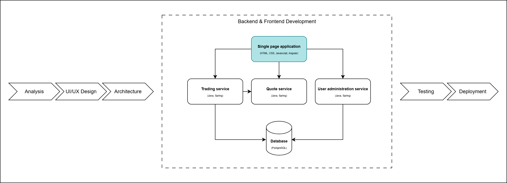

# Frontend Development: Create Dashboard Page with Angular



For this tutorial to work, it's essential to have Node.js, npm, and the Angular CLI installed on your machine. Node.js enables server-side JavaScript execution, while npm helps manage project dependencies. The Angular CLI is a command-line tool that simplifies the development of Angular applications. If you haven't installed these yet, you can download Node.js and npm from the official  [Node.js](https://nodejs.org/) website and install the [Angular CLI](https://angular.dev/installation#install-angular-cli) using npm.

**IMPORTANT**: Make sure you have Angular CLI version 18 installed globally to avoid compatibility issues with the commands used in this tutorial. You can install it using:

```bash
npm install -g @angular/cli@18
```

To verify your Angular CLI version, run:

```bash
ng version
```

If you missed last week's session, you'll also need to install [Git](https://git-scm.com/) and clone the project repository using the command below, or download it directly from GitHub:

```bash
git clone https://github.com/webtoknow/fx-trading-app.git
```

## Table of contents
- [Exercise 0 - Configure and start Mock Server](#exercise-0---configure-and-start-mock-server)
- [Exercise 1 - Create blotter-view, fx-rates-view and widget components](#exercise-1---create-blotter-view-fx-rates-view-and-widget-components)
- [Exercise 2 - Blotter View page](#exercise-2---blotter-view-page)
  - [Transaction model](#transaction-model)
  - [Trade service](#trade-service)
  - [Update Application Module](#update-application-module)
  - [Implement polling mechanism](#implement-polling-mechanism)
  - [Blotter View component](#blotter-view-component)
- [Exercise 3 - FX Rates View page](#exercise-3---fx-rates-view-page)
  - [Rate model](#rate-model)
  - [Update Trade service](#update-trade-service)
  - [Widget component](#widget-component)
  - [FX Rates View component](#fx-rates-view-component)

## Exercise 0 - Configure and start Mock Server

Mock server is used to create a fake API to mock the backend data using [JSON Server](https://github.com/typicode/json-server).

**Note**: The Mock Server serves as a **backup solution** for local development when the backend services are not available. If you completed the previous Frontend session and configured the reverse proxy (Exercise 0.1), you should already be integrated with the real backend services. Use the Mock Server only if you need to work independently without the backend.

Let's install its packages:

```bash
cd fx-trading-app\07_Frontend_Development\Exercise\Code\mock-server
npm install
```

Start all microservices in a single terminal:

```bash
npm start
```

Now we can access these APIs:

- `http://localhost:8200/user/authenticate` - sign-in
- `http://localhost:8200/user/register` - register
- `http://localhost:8210/transactions` - get all transactions
- `http://localhost:8220/currencies` - get all currencies
- `http://localhost:8220/fx-rate` - get fx rates for specific currencies

**Remember**: For production-like development, ensure your **ui/src/app/constants.ts** file uses the proxy paths configured in the previous session (`/auth`, `/trade`, `/quote`) and that your **package.json** start script includes `--proxy-config proxy.conf.json`.


## Exercise 1 - Create blotter-view, fx-rates-view and widget components

Go to *07_Frontend_Development/Exercise/Code/ui* using a new **terminal** windows: 

```bash
cd fx-trading-app/07_Frontend_Development/Exercise/Code/ui
```

Run `npm install` to download all dependencies:

```bash
npm install
```
Start dev server:

```bash
npm run start
```

By taking a look at the design mockup, we can see that it can be divided in 2 big sections: **FX Rates View** and **Blotter View**. Also, the first one contains many widgets looking the same, so this can be also splitted into **Widget** components.

So, *dashboard-page* component will use 3 smaller components:

- *blotter-view*
- *fx-rates-view*
- *widget*

Let's create them!

First, go to *07_Frontend_Development/Exercise/Code/ui/src/app/pages/dashboard-page* and use Angular CLI to create these 3 new components, children of *dashboard-page* components:

```bash
cd fx-trading-app/07_Frontend_Development/Exercise/Code/ui/src/app/pages/dashboard-page

ng generate component blotter-view
ng generate component fx-rates-view
ng generate component widget
```

Additionally, using the Angular CLI has automatically updated the` app.module.ts` file to include the newly created components.

In the design, the top section features a navbar that includes the logo and a Logout button. We'll now incorporate this into the `dashboard-page` component along with the `blotter-view` and `fx-rates-view` components. To structure the layout, we'll utilize Bootstrap for styling and positioning.

So, in *dashboard-page.component.html*, we will have:

```HTML
<!-- Navigation -->
<header>
  <nav class="navbar">
    
    <a href="#" class="btn btn-logout">Log out</a>
  </nav>
</header>

<main class="dashboard-container">
  <div class="row">
    <div class="col-sm">
      <app-fx-rates-view></app-fx-rates-view>
    </div>
    <div class="col-sm">
      <app-blotter-view></app-blotter-view>
    </div>
  </div>
</main>
```

and in *dashboard-page.component.css*:

```CSS
.dashboard-container {
  padding: 2rem 3rem;
}

.navbar {
    padding: 0.5rem 3rem;
    border: 1px solid #DDDDDD;
}

.fx-main-logo {
    width: 70px;
    height: 50px;
}

.btn-logout {
    border: 1px solid #dddddd;
    color: #7c7c7c;
}

.btn-logout:hover {
    background-color: #F2F2F2;
    opacity: 0.8;
}
```
## Exercise 2 - Blotter View page

### Transaction model

Into *07_Frontend_Development/Exercise/Code/ui/src/app/models*, let's make a new file, named `transaction.ts`,representing the *Transaction* model:

```JavaScript
export interface Transaction {
  id?: number;
  username: string;
  primaryCcy: string
  secondaryCcy: string;
  rate: number;
  action: string;
  notional: number | null;
  tenor: string;
  date: number;
  ccyPair?: string
}
```

### Trade service

In *07_Frontend_Development/Exercise/Code/ui/src/app/services*, let's create a file, *trade.service.ts*, which will contain all API calls desired to get data from JSON Server.

```bash
cd 07_Frontend_Development/Exercise/Code/ui/src/app/services
ng generate service trade
```

Let's introduce our first method, which will retrieve all transactions to be displayed in the table on the right side of the page:

```JavaScript
import { Injectable } from '@angular/core';
import { backendUrl } from '../constants';
import { HttpClient } from '@angular/common/http';
import { Observable } from 'rxjs';
import { Transaction } from '../models/transaction';

@Injectable({
  providedIn: 'root',
})
export class TradeService {
  constructor(private http: HttpClient) {}

  getTransactions() {
    return this.http.get(
      backendUrl.fxTradeService.getTransactions
    ) as Observable<Transaction[]>;
  }
}
```

The `getTransactions()` method calls the API endpoint defined in the constants file (`backendUrl.fxTradeService.getTransactions`) using an HTTP `GET` request and returns an `Observable` of `Transaction[]`. This will allow the table to display the retrieved transactions.

### Update Application Module

In app.module.ts, include *Trade Service*:

```JavaScript
import { TradeService } from './services/trade.service';

providers: [
    ...,
    TradeService,
    ...
]
```

### Implement polling mechanism

To simulate real-time updates of transactions, we'll implement a polling mechanism. This will allow us to repeatedly fetch transactions every 2 seconds, creating a real-time experience.

Here's how you can add a polling method in `trade.service.ts`:

```JavaScript
import { interval } from "rxjs";
import {startWith, switchMap} from "rxjs/operators";

  getTransactionsPolling() {
        return interval(2000)
            .pipe(
                startWith(0),
                switchMap(() => this.http.get(backendUrl.fxTradeService.getTransactions)
            )
        ) as Observable<Transaction[]>
    }
```

Explanation:
- `interval(2000)`: Creates an observable that emits a value every 2 seconds.
- `startWith(0)`: Ensures the polling starts immediately without waiting for the first 2-second interval.
- `switchMap()`: Maps each emitted value to the HTTP request to fetch transactions. It ensures that only the latest HTTP request is handled while canceling the previous one if still pending.

This method will continuously call the API every 2 seconds and update the data accordingly.

### Blotter View component

We'll use the Blotter View component to present the transaction data in a table format. This component will also include filtering options, allowing users to filter transactions by currency pair and date:

**blotter-view.component.html**:

```HTML
<div class="title title-border">
  <h4>Blotter View</h4>
</div>
<div class="filter-container">
  <span class="flex-vertical-centered filter-label">Filters</span>
  <span class="flex-vertical-centered filter-separator">|</span>
  <div class="filter-input-container">
    <div class="flex-vertical-centered filter-group">
      <span>Ccy&nbsp;Pair&nbsp;&nbsp;</span>
      <select
        name="Ccy"
        id="Ccy"
        class="form-control form-control-sm"
        [(ngModel)]="filter.ccyPair"
        (ngModelChange)="filterBy()"
      >
        <option value="" selected>Please select&nbsp;&nbsp;</option>
        <option
          *ngFor="let currencyPair of currenciesPairs"
          [value]="currencyPair"
        >
          {{ currencyPair }}
        </option>
      </select>
    </div>

    <div class="flex-vertical-centered filter-group">
      <span for="dateFilter">Date&nbsp;&nbsp;</span>
      <div class="input-group input-group-sm">
        <input
          type="text"
          class="form-control form-control-sm"
          placeholder="Please select&nbsp;"
          [(ngModel)]="filter.date"
          (ngModelChange)="filterBy()"
          [bsConfig]="{ dateInputFormat: 'DD/MM/YYYY' }"
          #dp="bsDatepicker"
          bsDatepicker
        />
        <div class="input-group-append">
          <button
            class="input-group-text calendar-icon"
            id="date-picker-icon"
            (click)="dp.show()"
            [attr.aria-expanded]="dp.isOpen"
          >
            <i class="fa fa-calendar-check-o icon" aria-hidden="true"></i>
          </button>
        </div>
      </div>
    </div>
  </div>
</div>

<div class="table-responsive">
  <table class="table table-striped table-sm">
    <thead class="blotter-table-header">
      <tr>
        <th>ID</th>
        <th>
          <span>Username&nbsp;</span>
        </th>
        <th>
          <span>Ccy Pair&nbsp;</span>
        </th>
        <th>Rate</th>
        <th>
          <span>Action&nbsp;</span>
        </th>
        <th>
          <span>Notional&nbsp;</span>
        </th>
        <th>Tenor</th>
        <th>
          <span>Transaction Date&nbsp;</span>
        </th>
      </tr>
    </thead>
    <tbody>
      <tr *ngFor="let transaction of transactions">
        <td>{{ transaction.id }}</td>
        <td>{{ transaction.username }}</td>
        <td>{{ transaction.ccyPair }}</td>
        <td>{{ transaction.rate | number }}</td>
        <td>{{ transaction.action }}</td>
        <td>{{ transaction.notional | number }}</td>
        <td>{{ transaction.tenor }}</td>
        <td>{{ transaction.date | date : "dd/MM/yyyy HH:mm" }}</td>
      </tr>
    </tbody>
  </table>
</div>
```

This template includes:

- A filter section for selecting Currency Pair and Date.
- A table to display transaction data: ID, Username, Currency Pair, Rate, Action, Notional, Tenor, and Transaction Date.

**blotter-view.component.css**:

```CSS
.filter-container {
  margin-bottom: 22px;
  display: flex;
}

.filter-label {
  text-transform: uppercase;
  font-weight: bold;
}

.filter-separator {
  color: rgb(221, 221, 221);
  margin-left: 10px;
  margin-right: 10px;
}

.filter-input-container {
  display: flex;
  align-items: center;
  justify-content: flex-start;
  flex: 1;
}

.filter-group {
  margin-right: 15px;
}

.calendar-icon {
  background-color: white;
  color: #7c7c7c;
}

.calendar-icon:focus {
  outline: 0;
}

.calendar-icon > i {
  font-size: 18px;
}

.blotter-table-header {
  background: #3496f0;
  color: white;
  overflow: hidden;
  white-space: nowrap;
}

.blotter-table-header th {
  padding-bottom: 6px;
  padding-top: 6px;
}

```

**blotter-view.component.ts**:

```JavaScript
import { Component } from '@angular/core';
import { Transaction } from '../../../models/transaction';
import { Subject, takeUntil } from 'rxjs';
import { TradeService } from '../../../services/trade.service';

@Component({
  selector: 'app-blotter-view',
  templateUrl: './blotter-view.component.html',
  styleUrl: './blotter-view.component.css',
})
export class BlotterViewComponent {
  filter = {
    ccyPair: '',
    date: 0,
  };

  private unsubscribe = new Subject();
  transactions: Transaction[] = [];
  private initialTransactions: Transaction[] = [];

  currenciesPairs: (string | undefined)[] = [];

  constructor(private tradeService: TradeService) {}

  ngOnInit() {
    this.startPooling();
  }

  startPooling(): void {
    this.tradeService
      .getTransactionsPolling()
      .pipe(takeUntil(this.unsubscribe))
      .subscribe((response) => {
        // Create transaction transform list by adding ccyPair
        const transactionsWithCcyPair: Transaction[] = response.map(
          (transaction) => ({
            ...transaction,
            ccyPair: `${transaction.primaryCcy}/${transaction.secondaryCcy}`,
          })
        );
        this.transactions = transactionsWithCcyPair;
        this.initialTransactions = [...transactionsWithCcyPair];
        // Get all Ccy pairs for select
        this.currenciesPairs = this.transactions
          .map((transaction) => transaction.ccyPair)
          .filter((x, i, a) => x && a.indexOf(x) === i);
        this.filterBy();
      });
  }

  getDateWithoutHourAndMinuteAndSeconds(date: number) {
    return new Date(
      new Date(date).getFullYear(),
      new Date(date).getMonth(),
      new Date(date).getDay()
    );
  }

  filterBy(): void {
    this.transactions = this.initialTransactions
      .filter(
        (transaction) =>
          (this.filter.ccyPair &&
            transaction.ccyPair === this.filter.ccyPair) ||
          !this.filter.ccyPair
      )
      .filter(
        (transaction) =>
          (this.filter.date &&
            this.getDateWithoutHourAndMinuteAndSeconds(
              transaction.date
            ).getTime() ===
              this.getDateWithoutHourAndMinuteAndSeconds(
                this.filter.date
              ).getTime()) ||
          !this.filter.date
      );
  }

  ngOnDestroy() {
    this.unsubscribe.next('');
    this.unsubscribe.complete();
  }
}
```

Key Features:
- **Polling**: The `startPolling()` method fetches transactions every 2 seconds from the backend using the `getTransactionsPolling()` method in the TradeService.
- **Filtering**: The `filterBy()` method filters transactions by currency pair or date.
- **Cleanup**: The `ngOnDestroy()` method unsubscribes from the polling when the component is destroyed to prevent memory leaks.

## Exercise 3 - FX Rates View page

### Rate model

In the folder *07_Frontend_Development/Exercise/Code/ui/src/app/models*, create a new file named `rate.ts`. This file will define the Rate model:

```JavaScript
export interface Rate {
  buyRate: number;
  sellRate: number;
  ts: number;
}
```

### Widget model

In the same folder, *07_Frontend_Development/Exercise/Code/ui/src/app/models*, add a new file named `widget.ts` to define the **Widget** class and **RateTrend** enum:

```JavaScript
export class Widget {
  constructor(
    public primaryCcy: string = '',
    public secondaryCcy: string = '',
    public buyRate: number = 0,
    public sellRate: number = 0,
    public notional: number | null = null,
    public tenor: string = '',
    public pickCCYState: boolean = true
  ) {}
}

export enum RateTrend {
  UP = 'up',
  DOWN = 'down',
  FLAT = 'flat',
}

```

### Update Trade service

We will add a few more methods to `trade.service.ts`:

- `saveTransaction` method for saving the transaction when the user clicks the *Sell* or *Buy* buttons:

```JavaScript
  saveTransaction(transaction: Transaction) {
    return this.http.post(
      backendUrl.fxTradeService.saveTransaction,
      transaction
    ) as Observable<any>;
  }
```

- Two new methods for selecting currencies and getting FX rates:

```JavaScript
import { Rate } from 'src/app/models/rate';

  getCurrencies() {
    return this.http.get(backendUrl.quoteService.getCurrencies) as Observable<
      string[]
    >;
  }

  getFxRate(primaryCcy: string, secondaryCcy: string) {
    return this.http.get(backendUrl.quoteService.getFxRate, {
      params: { primaryCcy, secondaryCcy },
    }) as Observable<Rate>;
  }
```

- `getFxRatePolling` method to simulate real-time updates of FX rates:

```JavaScript
  getFxRatePolling(primaryCcy: string, secondaryCcy: string) {
    return interval(2000).pipe(
      startWith(0),
      switchMap(() =>
        this.http.get(backendUrl.quoteService.getFxRate, {
          params: { primaryCcy, secondaryCcy },
        })
      )
    ) as Observable<Rate>;
  }
```

### Widget component

**widget.component.html**:

```HTML
<div class="content-widget">
  <!-- Close -->
  <div (click)="onDelete()">
    <span class="fa fa-times close"></span>
  </div>

  <!-- Select currency step -->
  <div *ngIf="widget.pickCCYState">
    <h4 class="widget-title">Pick a currency</h4>
    <div class="content-container">
      <div class="mb-3 row">
        <label class="col-sm-3 col-form-label" for="primaryCcy">Primary</label>
        <div class="col-sm-9">
          <select
            name="primaryCcy"
            id="primaryCcy"
            class="form-control"
            [(ngModel)]="widget.primaryCcy"
            required
          >
            <option value="" disabled selected>Please select</option>
            <option *ngFor="let currency of currencies" [value]="currency">
              {{ currency }}
            </option>
          </select>
        </div>
      </div>
      <div class="mb-3 row">
        <label class="col-sm-3 col-form-label" for="secondaryCcy"
          >Secondary</label
        >
        <div class="col-sm-9">
          <select
            name="secondaryCcy"
            id="secondaryCcy"
            class="form-control"
            [(ngModel)]="widget.secondaryCcy"
            required
          >
            <option value="" disabled selected>Please select</option>
            <option *ngFor="let currency of currencies" [value]="currency">
              {{ currency }}
            </option>
          </select>
        </div>
      </div>
      <div class="btn-wraper">
        <button class="btn btn-primary" (click)="onPickCurrency()">Ok</button>
      </div>
    </div>
  </div>

  <!-- Trade step -->
  <div *ngIf="!widget.pickCCYState">
    <!-- Title -->
    <h4 class="widget-title no-border">
      <span class="widget-primary">{{ widget.primaryCcy }}</span
      >/{{ widget.secondaryCcy }}
      <span class="fa fa-exchange-alt exchange" (click)="onCCYChange()"></span>
    </h4>
    <!-- Rates -->
    <div class="rates-container">
      <div>
        <span class="widget-subtitle">SELL: </span>
        <span class="rate">{{ widget.sellRate | number : "1.1-2" }}</span>
        <i *ngIf="sellRateTrend === RateTrend.UP" class="fa fa-chevron-up rate-up"></i>
        <i *ngIf="sellRateTrend === RateTrend.DOWN" class="fa fa-chevron-down rate-down"></i>
        <i *ngIf="sellRateTrend === RateTrend.FLAT" class="fa fa-minus rate-flat"></i>
        
      </div>
      <div>
        <span class="widget-subtitle">BUY: </span>
        <span class="rate">{{ widget.buyRate | number : "1.1-2" }}</span>
        <i *ngIf="sellRateTrend === RateTrend.UP" class="fa fa-chevron-up rate-up"></i>
        <i *ngIf="sellRateTrend === RateTrend.DOWN" class="fa fa-chevron-down rate-down"></i>
        <i *ngIf="sellRateTrend === RateTrend.FLAT" class="fa fa-minus rate-flat"></i>
      </div>
    </div>
    <div class="content-container">
      <!-- Form  -->
      <div class="mb-3 row">
        <label class="col-sm-3 col-form-label" for="amount">Amount</label>
        <div class="col-sm-9">
          <input
            type="number"
            class="form-control"
            id="amount"
            placeholder="Type the amount"
            [(ngModel)]="widget.notional"
            required
          />
        </div>
      </div>
      <div class="mb-3 row">
        <label class="col-sm-3 col-form-label" for="tenor">Tenor</label>
        <div class="col-sm-9">
          <select
            name="tenor"
            id="tenor"
            class="form-control"
            [(ngModel)]="widget.tenor"
            required
          >
            <option value="" disabled selected>Please select</option>
            <option *ngFor="let tenor of tenors" [value]="tenor">
              {{ tenor }}
            </option>
          </select>
        </div>
      </div>
      <!-- Buttons  -->
      <div class="btns-wrapper">
        <button class="btn btn-primary" (click)="onSell()">Sell</button>
        <button class="btn btn-success" (click)="onBuy()">Buy</button>
      </div>
    </div>
  </div>
</div>
```


**widget.component.css**:

```CSS
.content-widget {
  width: 100%;
  position: relative;
}

.widget-title {
  padding: 1rem 1rem 10px;
  border-bottom: 1px solid #dddddd;
  margin: 0;
  font-size: 20px;
  font-weight: bold;
}

.widget-subtitle {
  font-size: 20px;
  color: #7c7c7c;
  font-weight: bold;
}

.widget-primary {
  font-size: 24px;
  color: #373a3c;
}

.widget-primary-currency {
  color: #373a3c;
  font-size: 24px;
}

.form-control {
  display: flex;
  flex-grow: 1;
}

.btn-wraper {
  display: grid;
  justify-content: flex-end;
}

.btns-wrapper {
  display: flex;
  justify-content: space-between;
}

.rates-container {
  display: flex;
  justify-content: space-between;
  background: #f2f2f2;
  padding: 10px 1rem;
}

.rate-up {
  color: green;
}

.rate-down {
  color: red;
}

.rate-flat {
  color: #373a3c;
}

.rate {
  font-size: 30px;
  font-weight: bold;
}

.content-container {
  padding: 1rem;
}

.close {
  position: absolute;
  top: 1rem;
  right: 1rem;
  font-size: 15px;
}

.no-border {
  border: 0;
}

.exchange {
  color: #f0ad4e;
  font-size: 18px;
  cursor: pointer;
}

@media only screen and (max-width: 1440px) {
  .rate {
    font-size: 26px;
  }
}
```

- **widget.component.ts**:

```JavaScript
import {
  Component,
  OnInit,
  Input,
  Output,
  EventEmitter,
  OnDestroy,
} from '@angular/core';
import { TradeService } from '../../../services/trade.service';
import { RateTrend, Widget } from '../../../models/widget';
import { Subject } from 'rxjs';
import { takeUntil } from 'rxjs/operators';
import { ToastrService } from 'ngx-toastr';

@Component({
  selector: 'app-widget',
  templateUrl: './widget.component.html',
  styleUrls: ['./widget.component.css'],
})
export class WidgetComponent implements OnInit, OnDestroy {
  tenors = ['SP', '1M', '3M'];
  unsubscribe = new Subject();
  buyRateTrend: RateTrend = RateTrend.FLAT;
  sellRateTrend: RateTrend = RateTrend.FLAT;
  public RateTrend = RateTrend;

  @Input() widget: Widget = new Widget();
  @Input() index: number = 0;
  @Input() currencies: string[] = [];
  @Output() deleted = new EventEmitter<number>();

  constructor(
    private tradeService: TradeService,
    private toastr: ToastrService
  ) {}

  ngOnInit() {}

  onDelete() {
    this.deleted.emit(this.index);
  }

  onSell() {
    const { notional, tenor } = this.widget;
    if (notional && tenor) {
      const username: string =
        JSON.parse(localStorage.getItem('currentUser') || '').username || '';
      this.tradeService
        .saveTransaction({
          username: username,
          primaryCcy: this.widget.primaryCcy,
          secondaryCcy: this.widget.secondaryCcy,
          rate: this.widget.sellRate,
          action: 'SELL',
          notional: this.widget.notional,
          tenor: this.widget.tenor,
          date: Math.round(new Date().getTime() / 1000),
        })
        .subscribe((response) => {
          this.toastr.success('Transaction saved!');
        });
    } else {
      this.toastr.error('Please fill in both Amount and Tenor!');
    }
  }

  onBuy() {
    const { notional, tenor } = this.widget;
    if (notional && tenor) {
      const username: string =
        JSON.parse(localStorage.getItem('currentUser') || '').username || '';
      this.tradeService
        .saveTransaction({
          username: username,
          primaryCcy: this.widget.primaryCcy,
          secondaryCcy: this.widget.secondaryCcy,
          rate: this.widget.buyRate,
          action: 'BUY',
          notional: this.widget.notional,
          tenor: this.widget.tenor,
          date: Math.round(new Date().getTime() / 1000),
        })
        .subscribe((response) => {
          this.toastr.success('Transaction saved!');
        });
    } else {
      this.toastr.error('Please fill in both Amount and Tenor!');
    }
  }

  onCCYChange() {
    this.switchCCY();
  }

  switchCCY() {
    const tempCCY = this.widget.primaryCcy;
    this.widget.primaryCcy = this.widget.secondaryCcy;
    this.widget.secondaryCcy = tempCCY;
  }

  startPooling() {
    const { primaryCcy, secondaryCcy } = this.widget;
    this.tradeService
      .getFxRatePolling(primaryCcy, secondaryCcy)
      .pipe(takeUntil(this.unsubscribe))
      .subscribe((response) => {
        this.widget.buyRate = response.buyRate;
        this.widget.sellRate = response.sellRate;

        if (this.widget.buyRate === 0 || this.widget.sellRate === 0) {
          return;
        }

        this.buyRateTrend =
          this.widget.buyRate > response.buyRate
            ? RateTrend.DOWN
            : this.widget.buyRate < response.buyRate
            ? RateTrend.UP
            : RateTrend.FLAT;

        this.sellRateTrend =
          this.widget.sellRate > response.sellRate
            ? RateTrend.DOWN
            : this.widget.sellRate < response.sellRate
            ? RateTrend.UP
            : RateTrend.FLAT;
      });
  }

  onPickCurrency() {
    const { primaryCcy, secondaryCcy } = this.widget;
    if (primaryCcy && secondaryCcy && primaryCcy !== secondaryCcy) {
      this.widget.pickCCYState = false;
      this.startPooling();
    } else if (!primaryCcy || !secondaryCcy) {
      this.toastr.error('Please select both Primary and Secondary Currencies!');
    } else {
      this.toastr.error(
        'Please select different Primary and Secondary Currencies!'
      );
    }
  }

  ngOnDestroy() {
    this.unsubscribe.next('');
    this.unsubscribe.complete();
  }
}
```
Here are some key points to note:

- A widget can be removed by clicking the close icon located at the top-right corner.
- There are two main steps involved:
  - First, users can add a new currency pair, allowing them to monitor *BUY* and *SELL* rates. This step includes selecting Primary and Secondary currencies from two dropdowns, which are populated by calling the getCurrencies() method from trade.service.ts.
  - Second, users can save a transaction by entering the trade amount and selecting a tenor (SP for immediate, 1M for one month, or 3M for three months). They can then choose to execute a *Sell* or *Buy* action by pressing the respective button.


### FX Rates View component

The **FX Rates View** component displays multiple widgets on the left side of the page:

**fx-rates-view.component.html**:

```HTML
<h4 class="title">Fx Rates View</h4>
<div class="container-widget">
  <app-widget
    *ngFor="let widget of widgets; let i = index"
    class="widget"
    [widget]="widget"
    [index]="i"
    [currencies]="currencies"
    (deleted)="onDeleteWidget($event)"
  >
  </app-widget>
  <button class="button-widget" (click)="onAddWidget()">
    <span class="fa fa-plus button-plus"></span>
  </button>
</div>
```

So, as we can see:

- we use *Widget* Component (*app-widget*) for all widgets we have
- we have the possibility to add a new widget by clicking on a button

**fx-rates-view.component.css**:

```CSS
.container-widget {
  display: flex;
  flex-wrap: wrap;
  justify-content: space-between;
  padding-right: 2rem;
}

.button-widget {
  width: 47%;
  height: 250px;
  border: 1px solid grey;
  border-radius: 5px;
  padding: 10px;
}

.button-plus {
  font-size: 60px;
  color: grey;
}

.widget {
  display: flex;
  flex-basis: 47%;
  border: 1px solid grey;
  border-radius: 5px;
  margin-bottom: 2.5rem;
  height: 297px;
}

@media only screen and (max-width: 1440px) {
  .rate {
    font-size: 26px;
  }
}
```

**fx-rates-view.component.ts**:

```JavaScript
import { Component, OnInit } from '@angular/core';
import { Widget } from '../../../models/widget';
import { TradeService } from '../../../services/trade.service';

@Component({
  selector: 'app-fx-rates-view',
  templateUrl: './fx-rates-view.component.html',
  styleUrls: ['./fx-rates-view.component.css'],
})
export class FxRatesViewComponent implements OnInit {
  widgets: Widget[] = [];
  currencies: string[] = [];

  constructor(private tradeService: TradeService) {}

  ngOnInit() {
    this.tradeService.getCurrencies().subscribe((response) => {
      this.currencies = response;
    });
  }

  onAddWidget() {
    this.widgets = [...this.widgets, new Widget('', '', 0, 0, null, '', true)];
  }

  onDeleteWidget(index: number) {
    this.widgets.splice(index, 1);
  }
}
```

The FX Rates View component provides:

- A list of currencies from the backend to populate currency selectors in each widget.
- The ability to add or delete widgets dynamically.

> Congratulations, you've done it! You now have a fully functioning proof of concept for an FX trading application. Head over to *Chrome*, navigate to http://localhost:4200, register a user, and log in to the dashboard. From there, you can add widgets and execute trades. Great job!
