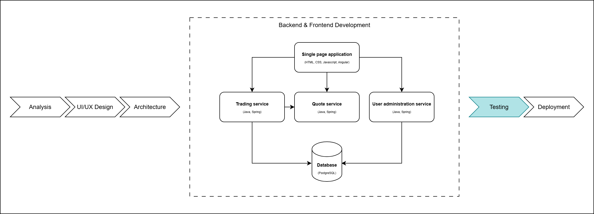

# Software Testing: Testing techniques

## Table of contents

- [EQUIVALENCE PARTITIONING AND BOUNDARY ANALYSIS](#equivalence-partitioning-and-boundary-analysis)
  - [Exercise 1](#exercise-1)
  - [Exercise 2](#exercise-2)
- [PAIRWISE TESTING](pairwise-testing)
  - [Exercise 3](#exercise-3)
  - [Exercise 4](#exercise-4)

## EQUIVALENCE PARTITIONING AND BOUNDARY ANALYSIS

### Exercise 1

An application for flight bookings has an input field for number of tickets to buy. Consider the following rule: not more than 10 tickets can be ordered at the same time.

- Identify the equivalent partitions and minimum number of tests for coverage.
- Identify the boundary values and number of tests for the above condition.

### Exercise 2

Consider an input field that accepts passwords with length between 8-12 characters.

- Identify the equivalent partitions and minimum number of tests for coverage.
- Identify the boundary values and number of tests for the above condition.

## PAIRWISE TESTING

### Exercise 3

A car company has business in Brasov and Bucharest where they can buy or sell cars. The company can trade only the following brands: BMW, Audi, Mercedes. Car booking can be accomplished in store or online. Buy/sell orders can be placed only during working hours. The application must have valid or invalid registration numbers.

- Establish total number of test cases(positive).
- Narrow down coverage using a pairwise technique.

### Exercise 4

An application interface contains a listbox with 10 elements (0-9), a check box, a radio button and a text box that accepts values from 1 to 100.

- Establish total number of test cases(positive).
- Narrow down coverage using a pairwise technique.
