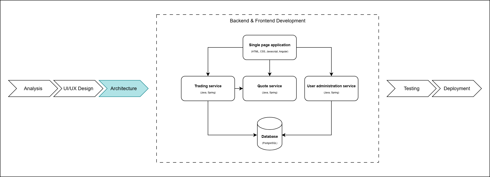

# Architecture and setup



## Project architecture


We can also download a draw.io diagram from [here](https://drive.google.com/file/d/1gqwqInmvqGzmxTmXexQ1iFbuM0e-E9qk/view?usp=sharing).

## Clone repo

We can clone the repository using GIT and the command below or we can download it directly from Github.

```bash
git clone https://github.com/WebToLearn/fx-trading-app.git
```

## Before Setup

Prior to setting up the Angular and Spring Boot project, it's essential to have the following programs installed on your local machine: [Node.js LTS](https://nodejs.org/en), [Java SE 11](https://www.oracle.com/java/technologies/javase/jdk11-archive-downloads.html), [PostgreSQL](https://www.postgresql.org/), and [PGAdmin](https://www.pgadmin.org/).

## Setup Angular

Install [Angular CLI](https://cli.angular.io/)

```bash
npm install -g @angular/cli
```

Got to *Week_04\Exercise\Code*

```bash
cd fx-trading-app\Week_04\Exercise\Code
```

Let's generate a new Angular project containing modules using CLI

```bash
ng new ui --no-standalone
```

> When you're asked, "Which stylesheet format would you like to use?", make sure to select **CSS**. Additionally, when prompted with "Do you want to enable Server-Side Rendering (SSR) and Static Site Generation (SSG/Prerendering)?", choose N (**No**).

Start the project

```bash
cd ui
ng serve
```

Congratulations! You have successfully set up your Angular project. 

After the build process completes in the terminal, you can access the app by opening a browser (such as Chrome) and navigating to `http://localhost:4200/`.


## Setup Spring Boot App and database

I. Generate a Spring Boot starter project with Maven as build tool  

Open [start.spring.io](https://start.spring.io/) in the browser.  

Select:

1. Maven Project
2. with Java
3. and a stable version of Spring Boot
4. Complete Group section. Example: *com.banking.sofware.design*
5. For Artifact choose a name like *demo*
6. Under Options select Java version 11
7. Select the following modules: Security, Web, JPA, PostgreSQL
8. Generate project

II. Create database  

In pgAdmin console:  

1. Create a database with name *demo*
2. Open a Query Tool in the newly created database and  
a) create a user that the application will use to connect  
b) give the newly created user access rights

Example:

```sql
CREATE USER demo_user WITH ENCRYPTED PASSWORD 'password';
GRANT ALL PRIVILEGES ON DATABASE demo TO demo_user;
```

III. Import project in IDE and set properties:  

In *src/main/resources/application.properties* configure database connection.
Use database and user created at previous step

```JAVA
spring.datasource.url=jdbc:postgresql://localhost:5432/demo
spring.datasource.username=demo_user
spring.datasource.password=password
spring.jpa.properties.hibernate.jdbc.lob.non_contextual_creation=true
```

After doing this, the application should start when running the main class: ```<ArtifactName>Application```
