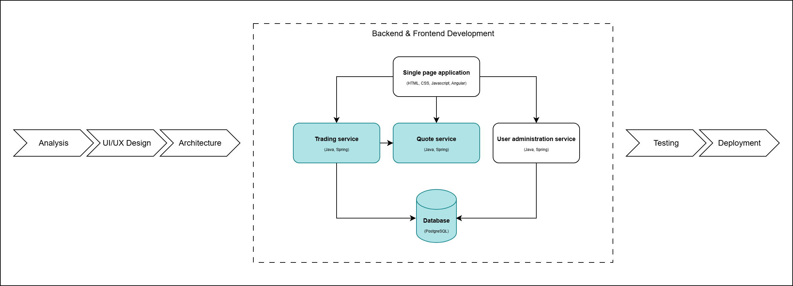
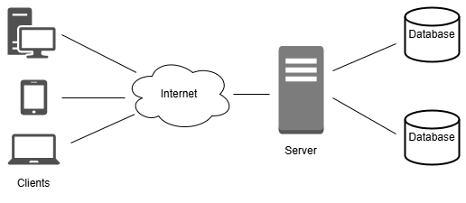

# Backend Development: Server-side programming



## Client-Server


## 1. Web servers

- Store software and website components files, such as HTML, JavaScript, CSS files.
- Contain HTTP server - software component which communicates using URLs and HTTP protocol.  
- Can be accessed via Internet by other devices.
- Can serve static or dynamic content.

**Why are they used?**
- retrieve data from a database to display it in a user interface
- validate user input data and store it in a database
- log users in and validate user permissions
  
  
<a href="https://developer.mozilla.org/en-US/docs/Learn/Server-side">Server Side Basics</a>

## 2.1 HTTP protocol

HTTP is a client-server, request-response protocol.  
An HTTP message contains a list of headers and in some of the cases a message body.  
For example if the server provides cookies to the client it will include a header named *Cookie*.  
There is a list of predefined HTTP headers, and you can add custom headers to your HTTP responses.

<a href="https://developer.mozilla.org/en-US/docs/Web/HTTP/Messages">HTTP Messages</a>

## 2.2 HTTP methods

Most common ones:  
- GET  
- POST  
- PUT  
- DELETE   

<a href="https://developer.mozilla.org/en-US/docs/Web/HTTP/Methods">Details</a>  

## 2.3 HTTP status codes  

200 OK   
3xx Redirection  
4xx Client error  
5xx Server error  

<a href="https://en.wikipedia.org/wiki/List_of_HTTP_status_codes">More information</a>  

# 3. REST (Representational State Transfer)  

REST is a set of conventions used separate the concerns of the client and server when creating web services.
Systems compliant to this paradigm are called RESTful, and they are stateless (client and server do not need to know anything about each other's state).
REST uses resources to describe any object, document, or thing that you may need to store or send to other services.

REST requires that a client make a request to the server in order to retrieve or modify data on the server.
A request generally consists of:
- an HTTP verb, which defines what kind of operation to perform
- a header, which allows the client to pass along information about the request
- a path to a resource
- an optional message body containing data

So for example:
- GET will be used to retrieve a specific resource (by id) or a collection of resources
- POST will be used to create a new resource
- PUT will be used to update a specific resource (by id)
- DELETE will be used to remove a specific resource by id

These operations listed above are commonly called CRUD (Create/Read/Update/Delete).  

# 4.1 Spring / Spring Boot

**Spring** is a framework providing a comprehensive programming and configuration model for modern Java-based enterprise applications - on any kind of deployment platform.

It comes with features like Dependency Injection, and out of the box modules like:

- Spring JDBC
- Spring MVC
- Spring Security
- Spring AOP
- Spring ORM
- Spring Test

**Spring Boot** is an extension of the Spring framework, which eliminates the boilerplate configurations required for setting up a Spring application.

Spring Boot features:
- starter dependencies to simplify the build and application configuration
- embedded server to avoid complexity in application deployment
- metrics, health check, and externalized configuration
- automatic configuration for Spring functionality, whenever possible

# 4.2 Inversion of Control and Dependency Injection

**Inversion of Control** is a principle in software engineering which refers to transferring the control over the flow of a program’s execution to a framework or a container, which manages the dependencies and their lifecycles.

Advantages of IoC:
- task execution is decoupled from task implementation 
- easy to switch between different implementations
- greater modularity of a program
- code is easier to test, by mocking dependencies and allowing components to communicate through contracts

IoC can be achieved through various mechanisms, such as: Strategy design pattern, Service Locator pattern, Factory pattern, and Dependency Injection (DI).

**Dependency Injection** is a design pattern used to implements IoC.
Connecting objects with other objects, or “injecting” objects into other objects, is done by an assembler rather than by the objects themselves.

Example - traditional programming:
```Java
public class Store {
   private Item item;
    
   public Store() {
      item = new ItemImpl1();    
   }
}
```

Example - using DI:
```Java
public class Store {
   private Item item;
   
   public Store(Item item) {
      this.item = item;
   }
}
```

An IoC container is a common characteristic of frameworks that implement IoC.
In Spring, the container is responsible for instantiating, configuring and assembling objects known as beans, as well as managing their lifecycles.

To enable component scanning and autoconfiguration of beans in Spring, the main method should be annotated with @SpringBootApplication. 

```Java
@SpringBootApplication
public class DemoApplication {
    public static void main(String[] args) {
        SpringApplication.run(DemoApplication.class, args);
    }
}
```

# 4.3 Spring MVC

Spring MVC lets you create special annotated beans to handle incoming HTTP requests.
To enable Spring MVC support through a Java configuration class, we just add the @EnableWebMvc annotation:
```Java
@EnableWebMvc
@Configuration
public class WebConfig {

    /// ...
}
```

## Controller
Controller classes contain endpoints - the access points from which an outside system can interact with our application. 
The endpoints receive requests from the other systems, and pass the requests to service classes which execute the business logic. 

Outside System ------> [Controller -> Service -> Repository] ------> Database

```Java
@Controller
@RequestMapping("/users")
public class UserController {
    private final UserService userService;

    @Autowired
    public UserController(UserService userService) {
        this.userService = userService;
    }

    @GetMapping("/{id}")
    public ResponseEntity<User> getUserById(@PathVariable Long id) {
        User user = userService.getUserById(id);
        return ResponseEntity.ok(user);
    }
}
```

## Service
Service classes contain the business related logic - which might include retrieving, modifying or deleting data.
Usually the service class needs information from the database or changes information into the database when performing an operation, so the service classes directly interact with repository classes.

```Java
@Service
public class UserService {
    private final UserRepository userRepository;

    @Autowired
    public UserService(UserRepository userRepository) {
        this.userRepository = userRepository;
    }
    
    public User getUserById(Long id) {
        return userRepository.findByUserId(id);
    }
}
```

## Repository
Repository classes contain the interactions with the database. 
Actions can be either adding new data in the database (register a new user) or retrieving data from the database (finding and existing user).

Spring Data provides an interface called JpaRepository, used for extending the CRUD interface.
It allows implementing custom database queries, and provides some out of the box methods, such as:
- findAll, findById, findOne
- count, exists, existsById
- save
- delete, deleteAll, deleteAll, deleteById
- deleteAllInBatch, deleteInBatch(Iterable<T> entities)

```Java
@Repository
public interface UserRepository extends JpaRepository<User, Long> {
    public User findByUserId(Long userId);

    @Query("SELECT u FROM User u WHERE u.userName = ?1 and u.password = ?2")
    public User findUserByStatusAndName(String userName, String password);
}
```

## Entities
Entity classes are part of Spring Data, and they represent mappings between Java classes and database tables.
Members of entity classes are mapped to columns in the database.

```Java
@Data
@Builder
@NoArgsConstructor
@AllArgsConstructor
@Entity
@Table(name = "user_login")
public class UserLogin {

    @Id
    @GeneratedValue(strategy = GenerationType.IDENTITY)
    @Column(name = "user_login_id", updatable = false, nullable = false)
    private Long userLoginId;

    @ManyToOne(fetch = FetchType.LAZY)
    @JoinColumn(name = "user_id")
    private User user;

    @Column(name = "token")
    private String token;

    @Column(name = "token_expire_time")
    private String tokenExpireTime;

}
```

# 4.4 REST client
RestClient is a synchronous HTTP client, which sends and receives HTTP requests and responses in a blocking manner, meaning it waits for each request to complete before proceeding to the next one.
RestClient can be used to communicate service-to-service, using HTTP calls.

```Java
RestClient restClient = RestClient.create();
String result = restClient.get()
        .uri(uriBase + "/users/123")
        .retrieve()
        .body(String.class);

User user = new User(124, "John");
ResponseEntity<Void> response = restClient.post()
        .uri(uriBase + "/users")
        .contentType(APPLICATION_JSON)
        .body(user)
        .retrieve()
        .toBodilessEntity();
```