# Week 2 – Analysis
# Week 2 – Analysis

## Table of contents

- [Game debrief considerations](#game-debrief-considerations)
- [So, what is business analysis? Who is a BA?](#so-what-is-business-analysis?-who-is-a-BA?)
- [What does a BA do?](#what-does-a-ba-do?)
- [Some context considerations. Methodologies](#some-context-considerations-methodologies)
- [Waterfall](#waterfall)
  - [Some good things about Waterfall](#some-good-things-about-waterfall)
  - [Some disadvantages of Waterfall](#some-disadvantages-of-waterfall)
  - [When (not) to use Waterfall](#when-(not)-to-use-waterfall)
- [Agile](#agile)
  - [Some good things about Agile](#some-good-things-about-agile)
  - [Some disadvantages of Agile](#some-disadvantages-of-agile)
  - [When (not) to use Agile](#when-(not)-to-use-Agile)
- [Waterfall/Agile](#waterfall/agile)
  - [Fundamental Assumptions](#fundamental-assumptions)
  - [Control](#control)
  - [Management Style](#management-style)
  - [Knowledge Management](#knowledge-management)
  - [Role Assignment](#role-assignment)
  - [Communication](#communication)
  - [Customer's Role](#customer's-role)
  - [Project Cycle](#project-cycle)
  - [Development Model](#development-model)
  - [Desired Organisational Form/Structure](#desired-organisational-form/structure)
- [Hybrid](#hybrid)
  - [Water-scrum-fall](#water-scrum-fall)
  - [Agifall](#agifall)
- [Golden rule of engagement](#golden-rule-of-engagement)
- [BA underlying activities](#ba-underlying-activities)
- [The circle of analysis](#the-circle-of-analysis)
- [Requirements - the cornerstone of analysis work. And of the projects](#requirements---the-cornerstone-of-analysis-work-and-of-the-projects)
- [Concepts](#concepts)
- [BRD](#brd)
- [FSD](#fsd)
- [Requirements, epics, user stories, acceptance criteria, use cases](#requirements,-epics,-user-stories,-acceptance-criteria,-use-cases)
- [MVP](#mvp)
- [UML](#uml)
- [Tools](#tools)
- [Skills](#skills)
- [Analysis process sneak peak (Agile)](#analysis-process-sneak-peak-(Agile))
- [Food for thought](#food-for-thought)

## Game debrief considerations

- The process. Rule owners:
  - Customer
  - Analysts
  - Other team members
  - Time slots
- Assumptions (What do we really know for sure? Did we confirmed out thoughts?)
- Ask
- Challenge. But do not bully :)
- What was delivered? (POC / pieces / full package)
- Customer satisfaction
- How we prepare for next projects?

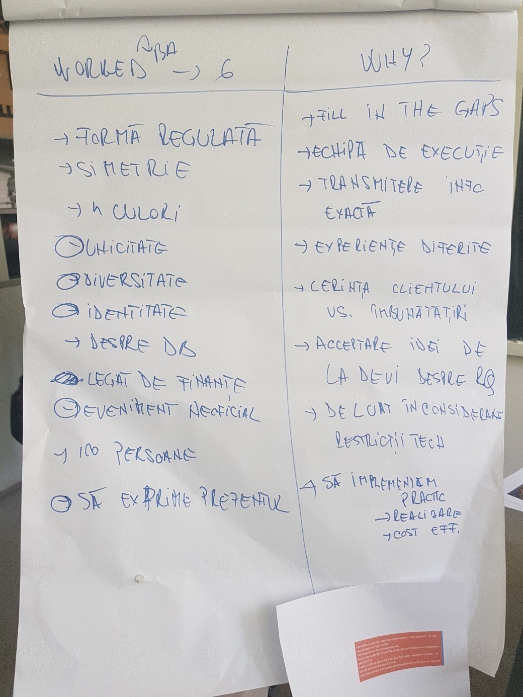

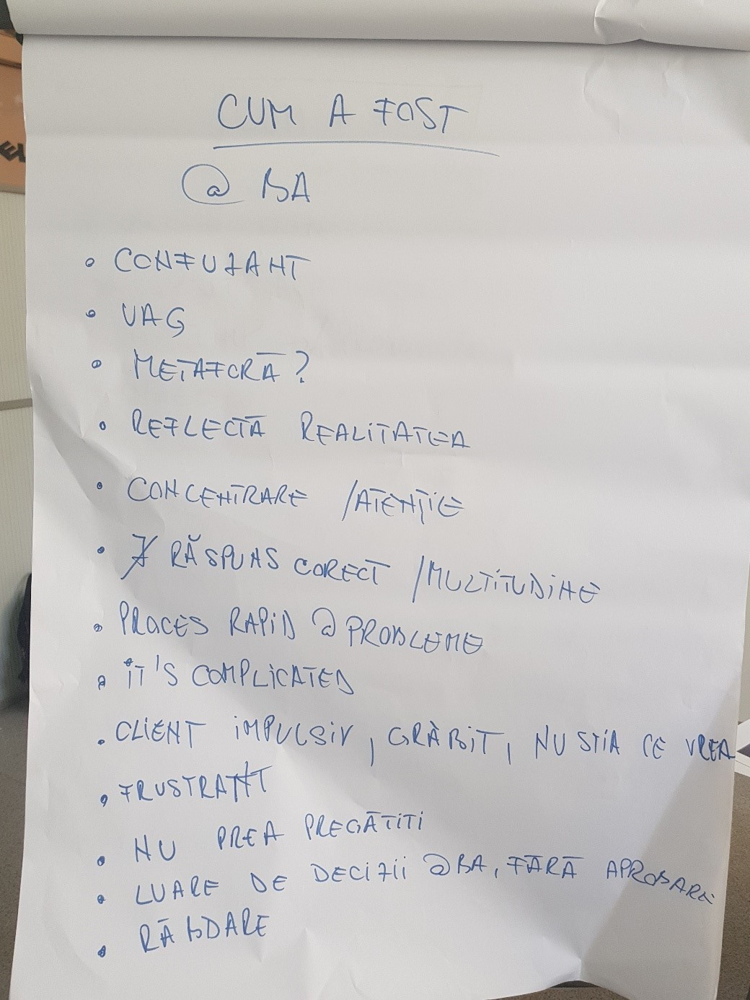

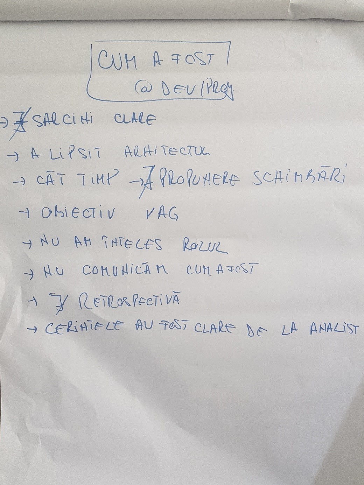

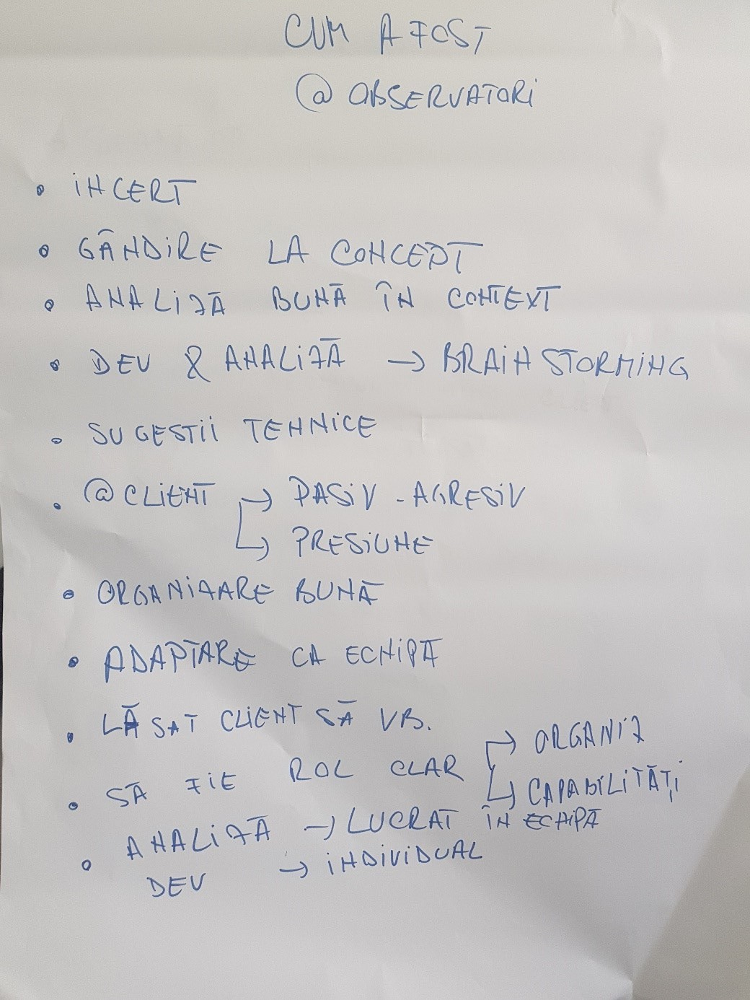

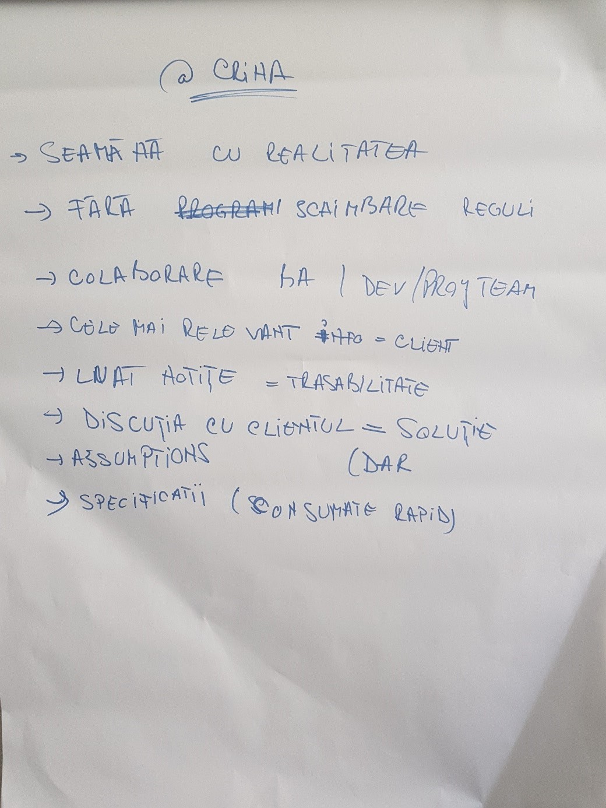

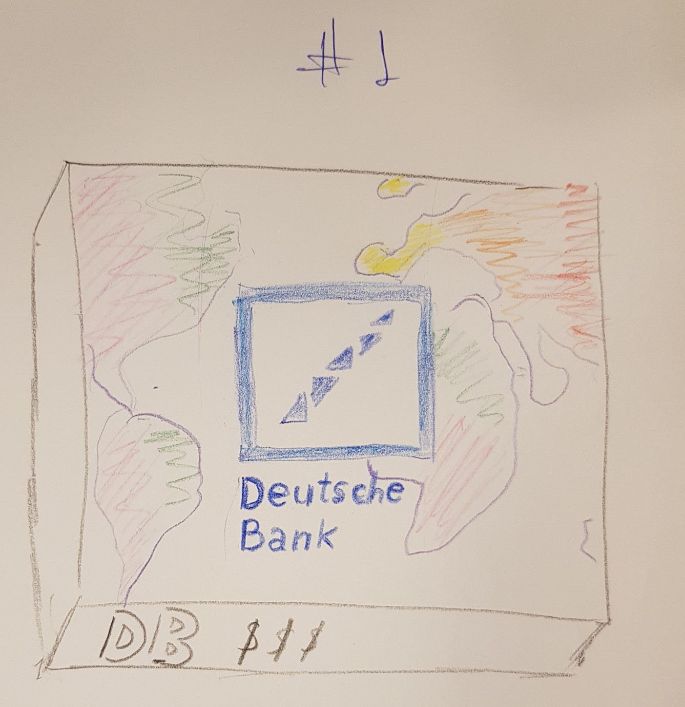

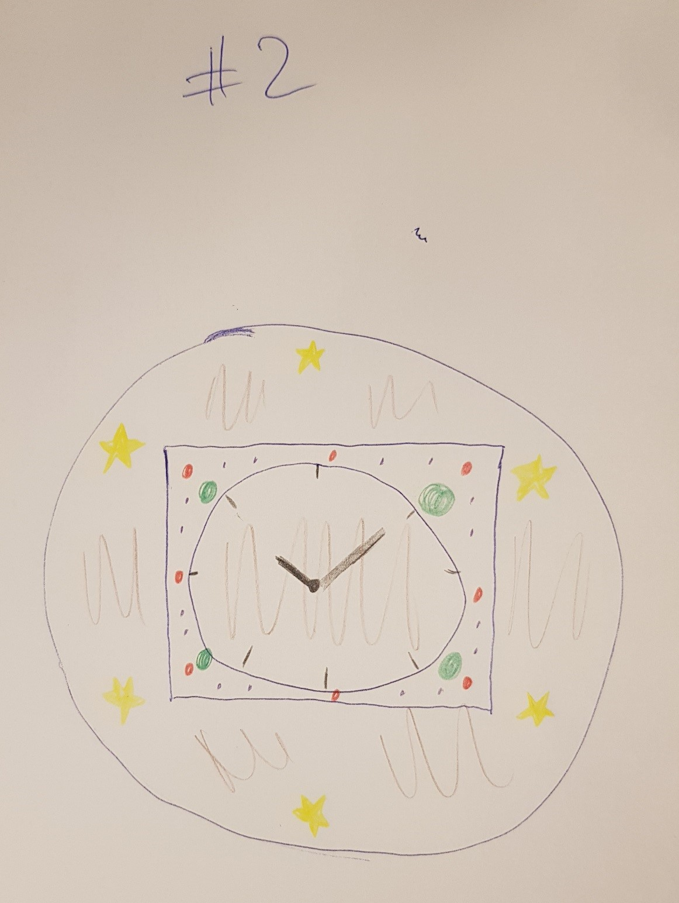

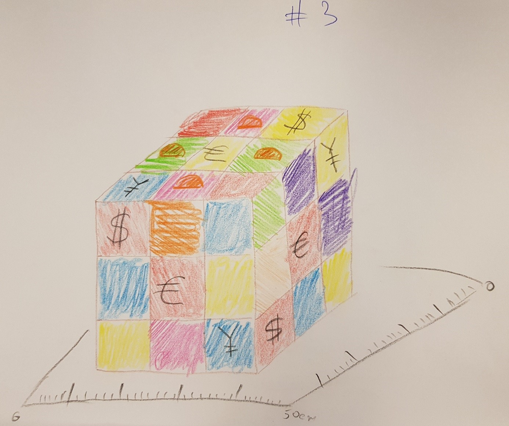

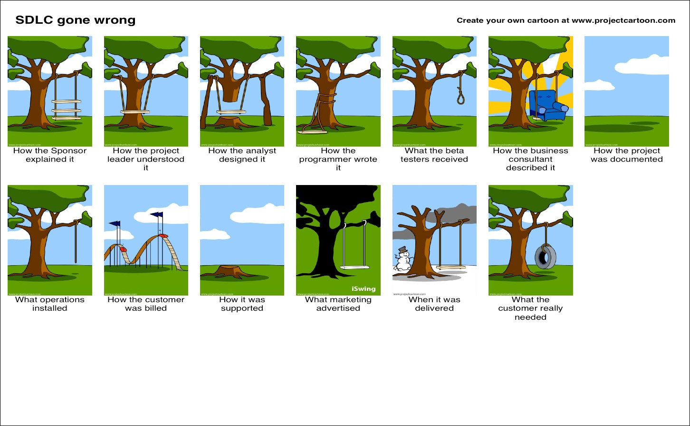

## So, what is business analysis? Who is a BA?

Business analysis is the **practice** of enabling **change** is an enterprise by defining **needs** and **recommending solutions** that deliver **value** to **stakeholders**.

Business analysts enables an enterpries to articulate needs and the rationale for **change**, and to support design and describe solutions that can deliver value.

Business analysts are responsible for discovering, synthesizing and analyzing information from a variety of sources within an enterprise, including tools, processes, documentation and stakeholders.

## What does a BA do?

Business analysts play a role in aligning the designed and delivered solutions with the needs of stakeholders. The activities that business analysts perform include:

- understanding enterprise problems and goals,
- analysing needs and solutions,
- devising strategies,
- driving change and
- facilitating stakeholder collaboration

## Some context considerations. Methodologies

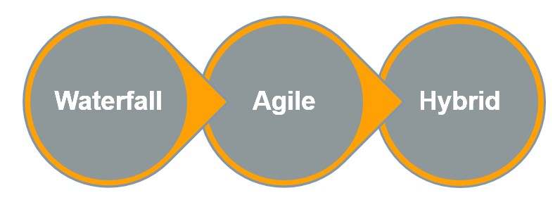

The two most popular methodologies used for IT projects (and not only) are:

- Waterfall -> this is the traditional approach
- Agile -> newer than Waterfall, often implemented using Scrum.

Hybrid is a combination of the two above-mentioned methodologies, not as opaque or strict as those two, created in order to allow a project-specific framework.

## Waterfall

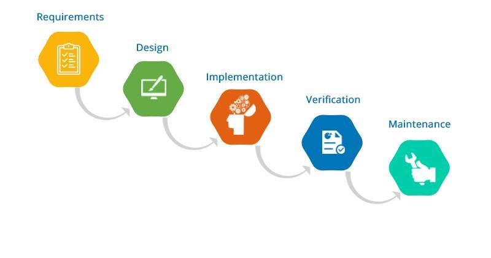

**Waterfall** is a linear approach to software development. In this methodology, the sequence of events is the following:

1. Gather and document requirements
2. Design
3. Implementation (including code and unit test)
4. Verification (including SIT, INT, UAT)
5. Deliver the finished product
6. Maintenance

In a **true** Waterfall development project, each of these represents a distinct stage of software development, and each stage generally finishes before the next one can begin. There is also typicalle a stage gate between each; for example, requirements **must** be reviewd and approved by the customer before design can begin.

### Some good things about Waterfall:

- Given that the agreement on what will be delivered happens in an early stage of the project, the planning is more straightforward.
- It is simple to understand and implement, since it is a linear model. Phases do not overlap.
- Members of the team could be involved with each other work, depending on the active phase of the project.
- The presence of the customer is needed in the Analysis phase only.

### Some disadvantages of Waterfall:

- Any changes required after the gathering and sign-off of requirements cannot be accommodate.
- Since the customer sees only the final product, no intermediary feedback is collected.
- High amounts of risk is the final phases.

### When (not) to use Waterfall:

- This model is used only when:
  - The requirements are very well known, clear and fixed;
  - Product definition is stable;
  - Technology is understood;
  - There are no ambiguous requirements;
  - Ample resources with required expertise are available freely;
  - The project is short.
- Not a good model for complex and object-oriented projects.
- Poor model for long and ongoing projects.
- Not suitable for the projects where requirements are at a moderate or high risk of changing

## Agile

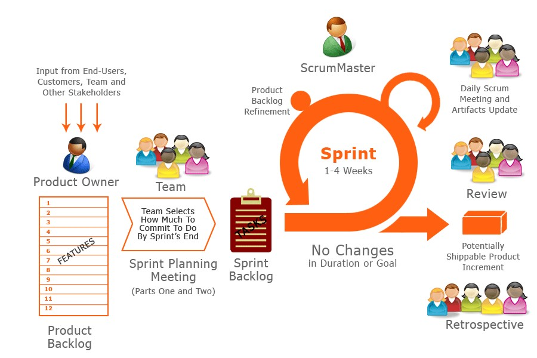

**Agile** is an iterative, team-based approach to development. The approach emphasizes the rapid delivery of an application in complete functional components. Rather than creating tasks and schedules, all time is "time-boxed" into phases called "sprints". Each sprint has a defined duration (usually in weeks) with a running list of deliverables, planned at the start of the sprint. Deliverables are prioritized by business value as determined by the customer. If all planned work for the sprint cannot be completed, work is reprioritized and the information is used for future sprint planning. 

As work is completed, it can be reviewd and evaluated by the project team and customer, through daily builds and end-of-sprint demos. Agile relies on a very high level of customer involvement throughout the project, but especially during these reviews.

The basis of Agile methodology is the [Agile manifesto](https://agilemanifesto.org/).

Agile is often implemented with Scrum. In Scrum there are some specific roles (Product Owner – responsible for backlog prioritization, Scrum Master (responsible with organizing the ceremonies), project team (BA, architects, developers, QA etc.)) and some ceremonies (sprint planning, daily meetings, grooming, demo, retrospective).

### Some good things about Agile:

- Rapid adjustment to changes;
- People and interactions are emphasized rather than process and tools.
- Working software is delivered frequently, therefore feedback is received in earlier stages of development.
- Development is more user focused.

### Some disadvantages of Agile: 

- The high degree of customer involvement might be an issue for customers who may not have the time for this type of participation.
- Members of the team are completely dedicated to only one project.
- The iterative nature of Agile might lead to frequent refactoring if the full scope is not considered in the initial architecture and design.
- At the beginning of the software development life cycle, it is difficult to assess the required effort.

### When (not) to use Agile:

- When new changes are needed to be implemented. The freedom agile gives to change is very important.
- Agile can be inefficient in large organizations/proiects
- Agile doesn’t work when the clients are not available for feedback.

## Waterfall/Agile

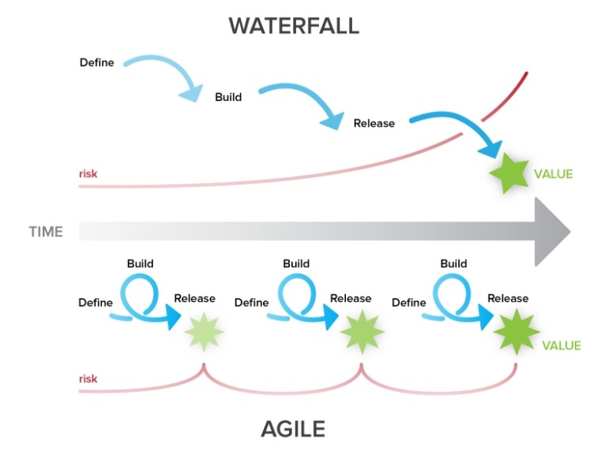

Differences between Waterfall and Agile:

### Fundamental Assumptions

Waterfall: Systems are fully specifiable, predictable, and can be built through meticulous and extensive planning.

Agile: High-quality, adaptive software can be developed by small teams using the principles of continuous design improvement and testing based on rapid feedback and change.

### Control

Waterfall: Process-centric  
Agile: People-centric

### Management Style

Waterfall: Command-and-control  
Agile: Leadership-and-collaboration

### Knowledge Management

Waterfall: Explicit  
Agile: Tacit

### Role Assignment

Waterfall: Individual—favors specialization  
Agile: Self-organizing teams—encourages role interchangeability

### Communication

Waterfall: Formal  
Agile: Informal

### Customer's Role

Waterfall: Important  
Agile: Critical

### Project Cycle

Waterfall: Guided by tasks or activities  
Agile: Guided by product features

### Development Model

Waterfall: Life cycle model (Waterfall, Spiral, or some variation)  
Agile: The evolutionary-delivery model

### Desired Organisational Form/Structure

Waterfall: Mechanistic  
Agile: Organic

## Hybrid

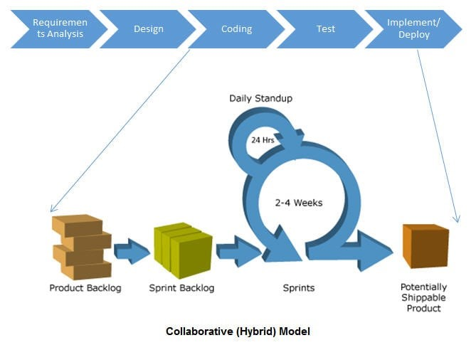

### Water-scrum-fall

One model that makes waterfall and agile get along is the [Water-scrum-fall](https://www.scrumalliance.org/community/articles/2015/june/water-scrum-fal) model.

Business analysis and release management teams follow the traditional waterfall methods, while the development and testing team scrum methods in a limited way.

Water-scrum-fall method employs the traditional waterfall approach for planning, requirements gathering, budgeting and documenting the project’s progress. When there are enough details to begin development, the team switches to a timeboxed, iterative version of Scrum for product development.

This method uses agile principles and scrum communication techniques in day-to-day activities related product development.

### Agifall

Agifall approach was first presented at [Vancouver Digital Product Managers Meetup Group](www.meetup.com/Vancouver-Digital-Project-Managers/). It combines the best of waterfall and agile by injecting the agile into a loose waterfall process.

The aim of Agifall is to increase the speed, decrease the cost and improve the quality. Agifall approaches planning in a user-centric manner and use quick prototype tools. It carries the planning and requirements activities of waterfall in an agile manner by breaking them into user stories and prioritizing them in the sprint.

n the Agifall method, you don’t wait for one phase to complete before starting the next phase; rather you begin the next phase as soon as you can. This means that you can begin independent development of some modules or components while the planning phase is still in progress. The development phase follows the usual agile principles.

Agifall model suggests graphic designing and testing in parallel with the development phase.

**If you want to check more about methodologies, please check:**

- http://agilemanifesto.org/ 
- http://www.agilenutshell.com/agile_vs_waterfall 
- https://www.atlassian.com/agile/scrum 
- http://www.itinfo.am/eng/software-development-methodologies/ 
- https://www.qasymphony.com/blog/agile-methodology-guide-agile-testing/
- https://reqtest.com/agile-blog/agile-waterfall-hybrid-methodology-2/ 
- https://www.seguetech.com/waterfall-vs-agile-methodology/ 
- https://www.smartsheet.com/agile-vs-scrum-vs-waterfall-vs-kanban 
- https://www.synopsys.com/blogs/software-security/top-4-software-development-methodologies/ 

## Golden rule of engagement

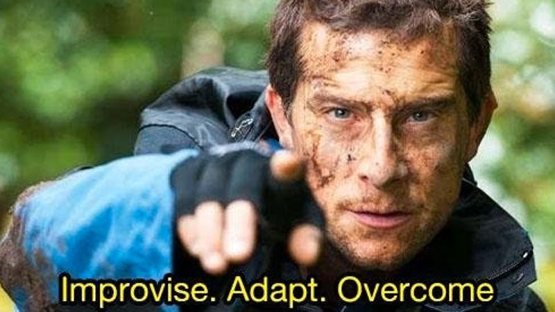

## BA underlying activities

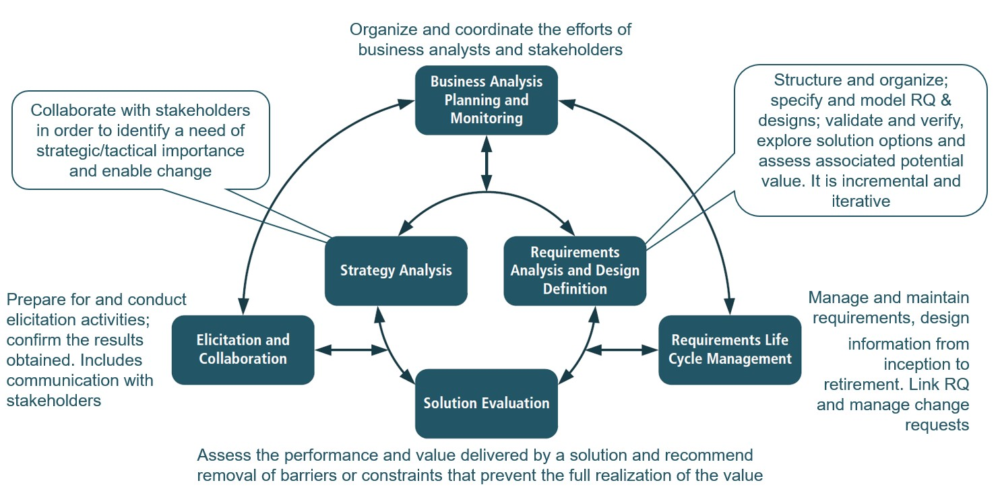

## The circle of analysis

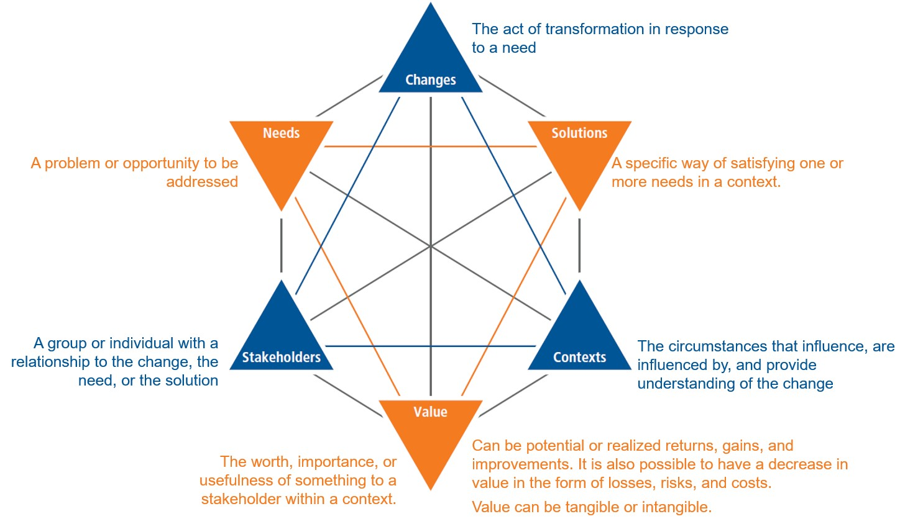

## Requirements - the cornerstone of analysis work. And of the projects

**Business requriements:** statements of goals, objectives, and outcomes that describe why a change has been initiated. They can apply to the whole of an enterprise, a business area, or a specific initiative

**Stakeholder requirements:** describe the needs of stakeholders that must be met in order to achieve the business requirements. They may serve as a bridge between business and solution requirements

**Solution requirements:** describe the capabilities and qualities of a solution that meets the stakeholder requirements. They provide the appropriate level of detail to allow for the development and implementation of the solution. Solution requirements can be divided into two sub-categories:

- ***functional requirements:*** describe the capabilities that a solution must have in terms of the behaviour and information that the solution will manage, and
- ***non-functional requirements*** or quality of service requirements: do not relate directly to the behaviour of functionality of the solution, but rather describe conditions under which a solution must remain effective or qualities that a solution must have

**Transition requirements:** describe the capabilities that the solution must have and the conditions the solution must meet to facilitate transition from the current state to the future state, but which are not needed once the change is complete. They are differentiated from other requirements types because they are of a temporary nature. Transition requirements address topics such as data conversion, training, and business continuity.

## Concepts

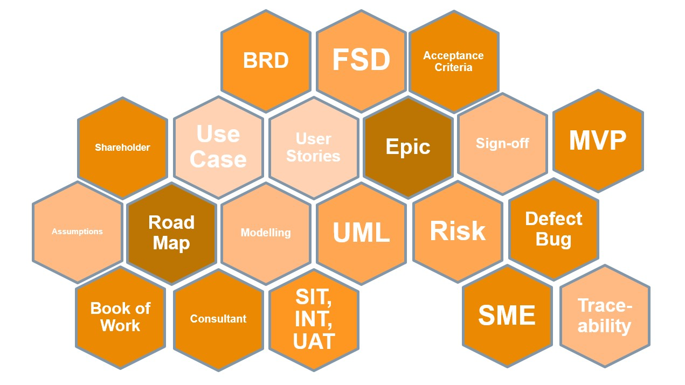

## BRD

- [How to Write a Business Requirements Document](http://www.requirementsnetwork.com/documents.htm)
- [A High-level Review from SixSigma perspective](https://www.isixsigma.com/implementation/project-selection-tracking/business-requirements-document-high-level-review/)
- [Traceability definition](https://en.wikipedia.org/wiki/Requirements_traceability)

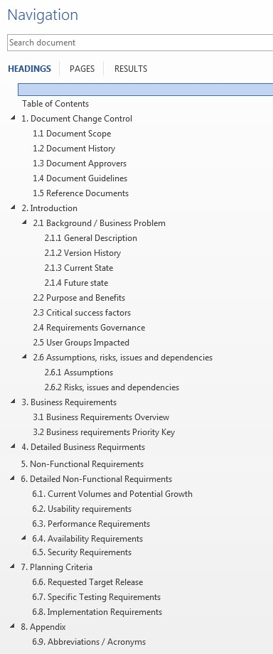

## FSD

- [What goes into a FSD (Functional Specifications Document)](https://www.bridging-the-gap.com/functional-specification/)
- [A sample](https://www.google.com/url?sa=t&rct=j&q=&esrc=s&source=web&cd=3&cad=rja&uact=8&ved=2ahUKEwjSi4zV7OfdAhXOyqQKHS6NDmEQFjACegQICBAC&url=https%3A%2F%2Fuit.stanford.edu%2Fsites%2Fdefault%2Ffiles%2F2017%2F08%2F30%2FAS%2520Functional%2520Specification%2520Document%2520Template_0.docx&usg=AOvVaw2pBQnjcXy51DVuTUpRJkER) (it will download a file)

## Requirements, epics, user stories, acceptance criteria, use cases

- [Agile Business Consortium – Requirements and User Stories handbook](https://www.agilebusiness.org/content/requirements-and-user-stories)
- [5 Common User Story Mistakes](https://www.romanpichler.com/blog/5-common-user-story-mistakes/)
- [Acceptance Criteria. Did We Build the Right Product? And, Did We Build the Product Right?](https://www.leadingagile.com/2014/09/acceptance-criteria/)
- [User stories vs. Epics vs. Themes](https://www.scrumalliance.org/community/articles/2014/march/stories-versus-themes-versus-epics)
- [Use Cases vs. User Stories](https://www.stellman-greene.com/2009/05/03/requirements-101-user-stories-vs-use-cases/)
- [Stakeholders](#stakeholders)

## Stakeholders

Generic list of stakeholders includes the following roles:

- business analyst,
- customer,
- domain subject matter expert,
- end user,
- implementation subject matter expert,
- operational support,
- project manager,
- regulator,
- sponsor,
- supplier and
- tester

**[Not to be confused with a Shareholder](https://www.investopedia.com/terms/s/shareholder.asp)!**

## MVP

- [What is a MVP](https://blog.leanstack.com/minimum-viable-product-mvp-7e280b0b9418)
- [3 examples of smart MVPs](https://www.youtube.com/watch?v=xPJoq_QVsY4)
- [Quickly validate your start-up](https://www.youtube.com/watch?v=jHyU54GhfGs). It involves cats :)

## UML

- [According to Wikipedia](https://en.wikipedia.org/wiki/Unified_Modeling_Language)
- [According to originators](www.uml.org/)

## Tools

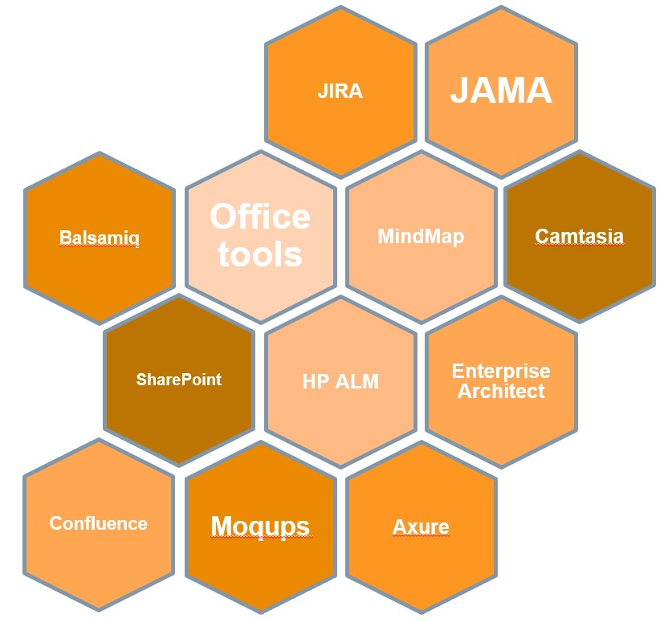

- [JAMA](https://www.jamasoftware.com/) - for business requirements management
- [JIRA](https://www.atlassian.com/software/jira) – originally designed for incident management. Started to be used in agile for user stories/epics management
- [Enterprise Architect](https://sparxsystems.com/products/ea/) - for modelling
- [Balsamiq](https://balsamiq.com/products/), [Moqups](https://moqups.com/) & [Axure](https://www.axure.com/) - for prototyping
- [ALM](https://software.microfocus.com/en-us/products/application-lifecycle-management/overview) - for testing
- [SharePoint](https://en.wikipedia.org/wiki/SharePoint) and [Confluence](https://en.wikipedia.org/wiki/Confluence_(software)) - for content management
- [Camtasia](https://www.techsmith.com/video-editor.html) - for smart user guides

## Skills

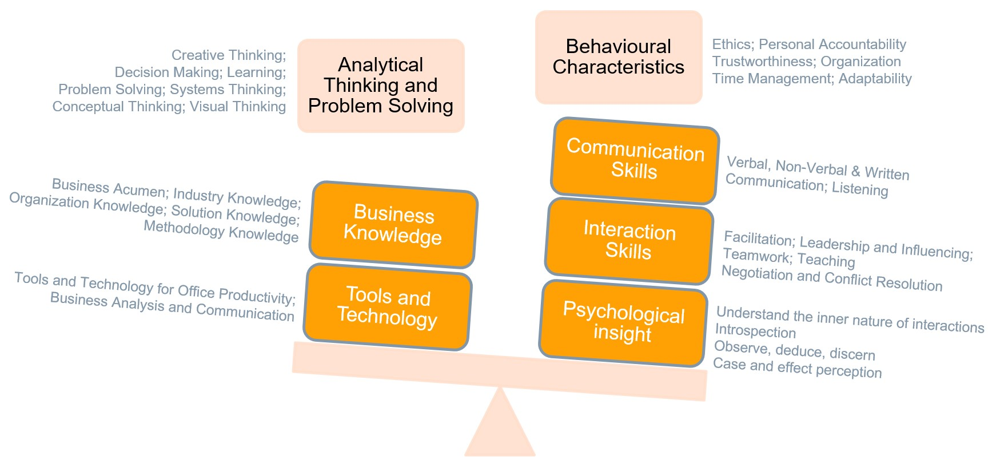

## Analysis process sneak peak (Agile)

## Food for thought

[Why a BA is so tired? Why is Business Analysis so hard?](www.its-all-design.com/why-is-business-analysis-so-hard/) (2013 dated, same story today)
