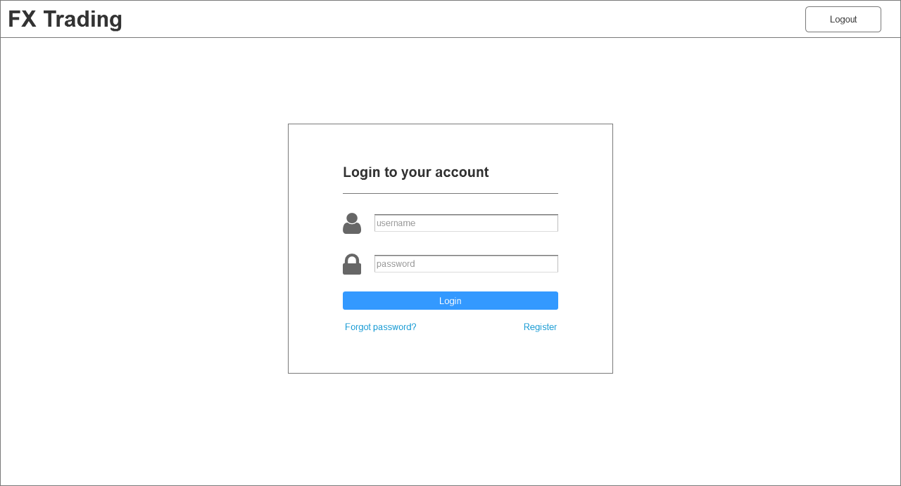
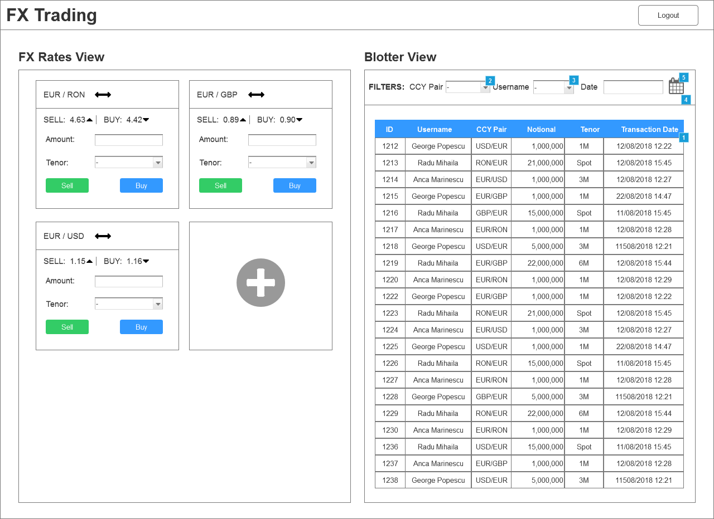
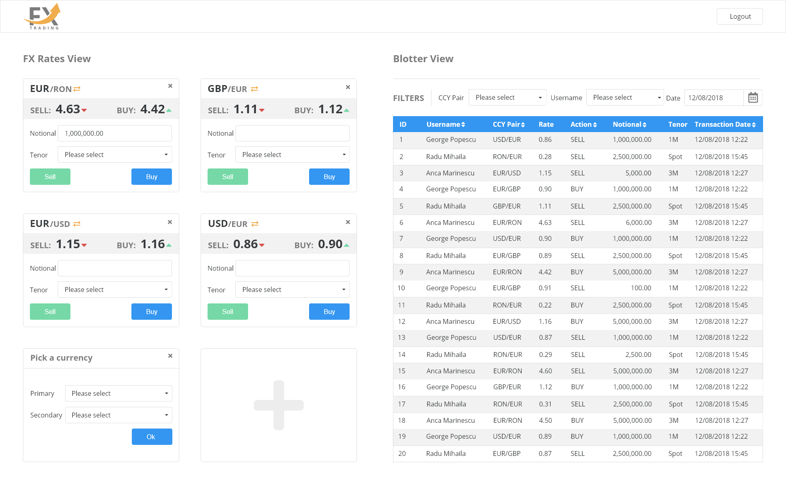

# Week 3 – Design

## Table of contents
- [Requirements](#requirements)
- [Exercise](#exercise)
- [Solution](#solution)
  - [Mind map - Mindmeister](#mind-map---mindmeister)
  - [Wireframe - Balsamiq](#wireframe---balsamiq)
  - [Prototype - Axure RP](#prototype---axure-rp)
  - [Visual Design - Adobe XD](#visual-design---adobe-xd)

## Requirements

### Register page
 
A page that allows the creation of a new account. 
 
The page contains the following elements:
 
page title: “Register a new account”

- “username” field 
- “email” field 
- “password” field 
- “password confirmation” field  
- “register” button 
- “Already have an account?” text that redirects the user to the login page

### Login page 
 
A page that allows an user to login, giving them access to the FX Trading Dashboard.
 
The page contains the following elements:
 
Page title: “Login to your account”

- username field
- password field
- login button
- “Don’t have an account” link that redirects the user to the Register page
- “Forgot my password” link
 
### FX Trading Dashboard
 
This page will give the users the option to sell and buy currency (called FX Rate View) and also view a history of the trades (called blotter view). The user is going to be part of a team and is able to see other team members’ activity.
 
 
### FX Rate View
 
FX rate gives user the option to trade several currencies (USD, EUR, GBP, RON and CHF).
Users must use one currency to buy one of the other currencies.
Users should be able to customize some aspects of the User Interface.
 
Elements needed:

- currency I want to buy (eg. EUR)
- currency I want to sell (eg. RON)
- currency exchange rates for sell/buy actions (eg. EUR/RON - buy: 4,6100 / sell: 4,7350) 
- notional - amount I want to buy/sell (eg. 1.000.000)
- tenor - When the trade will take place (eg. Now / 1 Month / 3 Months)
- buy Button
- sell Button
 
The user must be able to add more currency combinations to the dashboard (EUR/RON, EUR/USD, CHF/USD, etc.)
 
### Blotter View
 
The blotter view displays a transaction history for the user and other users in their team.
 
Fields needed:
 
- transaction id
- username
- currency pair (USD/EUR)
- currency exchange rate
- action (sell/buy)
- notional
- tenor
- transaction date/time
 
The user should be able to apply 3 filters to the dataset described above (currency pair, username, transaction date)
## Exercise

Analyse the user requirements and based on them try and sketch a prototype for the three main pages. Get feedback from the user and improve your sketches until you reach the optimal solution for their needs.

## Solution

### Mind map - Mindmeister

### Wireframe - Balsamiq

### Prototype - Axure RP

### Visual Design - Adobe XD

